# Sales Forecasting System
## Production-Grade End-to-End Time-Series Forecasting Platform

**Author**: Nikhil
**Repository**: <https://github.com/Nikkclaws/sales-forecasting-system>
**Version**: 1.0
**Status**: Implemented · Tested · CI-green · Docker-deployable

---

## Cover

| | |
|---|---|
| **Project name** | Sales Forecasting System |
| **Author** | Nikhil |
| **Domain** | Time-series forecasting (retail beverage sales) |
| **Coverage** | 43 US states · 260 weekly observations per state · 2019-01-06 → 2023-12-31 |
| **Primary objective** | Forecast next 8 weeks of sales per state with calibrated confidence intervals |
| **Methodology** | 5 model families · walk-forward CV · top-K ensembling · split-conformal CIs |
| **Delivery surface** | FastAPI (11 endpoints) · Streamlit dashboard (6 tabs) · Docker compose |
| **Headline innovation** | Automated per-state model leaderboard with normalised 0-100 accuracy rating |

---

## Table of contents

1. [Executive summary (one-page TL;DR for board members)](#1-executive-summary-one-page-tldr-for-board-members)
2. [Business framing](#2-business-framing)
3. [Problem statement and objectives](#3-problem-statement-and-objectives)
4. [Dataset overview and exploratory analysis](#4-dataset-overview-and-exploratory-analysis)
5. [System architecture](#5-system-architecture)
6. [Data processing pipeline](#6-data-processing-pipeline)
7. [Feature engineering](#7-feature-engineering)
8. [Model families](#8-model-families)
9. [Walk-forward cross-validation](#9-walk-forward-cross-validation)
10. [Ensembling: top-K selection and ridge stacking](#10-ensembling-top-k-selection-and-ridge-stacking)
11. [Split-conformal prediction intervals](#11-split-conformal-prediction-intervals)
12. [Explainability with SHAP](#12-explainability-with-shap)
13. [Drift detection and retraining loop](#13-drift-detection-and-retraining-loop)
14. [Model versioning and registry](#14-model-versioning-and-registry)
15. [REST API design](#15-rest-api-design)
16. [Streamlit dashboard](#16-streamlit-dashboard)
17. [Model comparison and accuracy ratings (the centrepiece)](#17-model-comparison-and-accuracy-ratings-the-centrepiece)
18. [Real-world examples](#18-real-world-examples)
19. [Deployment topology](#19-deployment-topology)
20. [Reliability, observability, security](#20-reliability-observability-security)
21. [Testing, linting and CI](#21-testing-linting-and-ci)
22. [Sample results and accuracy comparison](#22-sample-results-and-accuracy-comparison)
23. [Repository layout](#23-repository-layout)
24. [How to run](#24-how-to-run)
25. [Configuration reference (`config.yaml`)](#25-configuration-reference-configyaml)
26. [Innovations summary](#26-innovations-summary)
27. [Future work](#27-future-work)
28. [References](#28-references)

---

## 1. Executive summary (one-page TL;DR for board members)

This project delivers a **production-grade time-series forecasting platform** that predicts the next eight weeks of beverage sales for **43 US states** with calibrated 90 % confidence intervals. The system is designed as a real backend service rather than a notebook prototype.

**What is built**

- **Five competing model families per state**: ARIMA, SARIMA, Prophet, XGBoost (with Optuna hyperparameter search), and a PyTorch LSTM.
- **Walk-forward cross-validation** (no data leakage; same folds for every model so the comparison is statistically fair).
- **Automated model leaderboard** per state with a normalised 0-100 composite accuracy rating, exposed through a single REST endpoint and visualised in the dashboard.
- **Top-K dynamic ensembling** (default top-2) with four selectable weighting schemes including a **ridge stacking meta-learner**.
- **Split-conformal prediction intervals** wrapped around every base model — finite-sample valid, distribution-free CIs.
- **Eleven REST endpoints** including `/predict`, `/predict/breakdown`, `/backtest`, `/holiday_impact`, `/rankings`, Prometheus `/metrics/prom`, and a multi-page PDF generator.
- **Six-tab Streamlit dashboard** with KPI header, forecast view, member breakdown, **model comparison leaderboard**, walk-forward backtest, holiday impact and aggregate metrics.
- **Drift detection** (PSI + Kolmogorov-Smirnov), **versioned model registry** with one-shot rollback, **native XGBoost SHAP**, **Docker compose** deployment.

**Why it matters for the business**

| Capability | Business value |
|---|---|
| Per-state forecasts at scale | Inventory and supply-chain planning for 43 markets without one model per state being a hand-tuned project. |
| Automated model selection + ranking | The board sees *which* model is selected for each state and *by how much* it wins. The system's best-model decision is explainable, not opaque. |
| Calibrated 90 % CIs | Procurement and finance teams can act on intervals, not just point forecasts. Coverage is mathematically guaranteed (split-conformal). |
| One-command deployment | The full stack (`docker compose up`) provisions API + dashboard with no per-environment surgery. |
| Drift-aware retraining | When the recent 52 weeks diverge from history, the system flags it and a single API call retrains the affected state. |
| Versioned registry | Every training run is timestamped and instantly rollback-able by editing one field. |

**Headline result**

On Alabama and Texas (the two states currently in the registry), the LSTM and ARIMA models dominate; SARIMA fails dramatically (composite ratings of 16.5 and 9.7 respectively). The composite-rating system captures this competition transparently — if SARIMA had been pushed to production for Texas based on a single naive evaluation, mean absolute percentage error would be **685 %**.

---

## 2. Business framing

Forecasting beverage sales at the state level has direct operational consequences:

- **Inventory ordering**: A two-week SKU lead time means the planner needs an 8-week forecast envelope, not just a point estimate.
- **Promotional planning**: Holiday-week lift varies by state; the dashboard quantifies it per holiday.
- **Logistics utilisation**: Different states peak at different times of year (the heatmap in §4.5 makes this explicit).
- **Risk management**: A 90 % CI translates directly into safety stock; conformal coverage guarantees mean the buffer is no longer a guess.

The system replaces five separate manual forecasting workstreams (one per model family) and a sixth, manually-driven "which model do we trust?" meeting with a single deterministic, reproducible pipeline that emits a leaderboard the team can defend.

---

## 3. Problem statement and objectives

Given weekly historical sales of a single product category (Beverages) across 43 US states from 2019-01-06 through 2023-12-31, build a system that:

1. Forecasts the next eight weeks of sales for any selected state.
2. Provides calibrated 90 % confidence intervals around every forecast point.
3. Selects the best forecasting algorithm per state from a competitive set of five model families.
4. Quantifies and ranks models with a single transparent score so reviewers can defend model choices.
5. Exposes all of the above through a REST API and an interactive dashboard.
6. Detects data drift, supports retraining, and keeps every training run versioned.

This is treated as a backend-services problem, not a notebook exercise: every component is a class, configuration lives in a single YAML file, artefacts are versioned, and the full stack is reproducible with `docker compose up`.

---

## 4. Dataset overview and exploratory analysis

### 4.1 Schema and scale

| Property | Value |
|---|---|
| Source | `data/raw/sales.xlsx` |
| Schema | `State`, `Date`, `Total`, `Category` |
| Categories | 1 (Beverages) |
| States | 43 US states |
| Frequency | Weekly, predominantly Sunday-anchored |
| Span | 2019-01-06 → 2023-12-31 (260 weeks) |
| Records / state | ≈ 188 (≈ 4 years of weekly data) |
| Total sales 2019-2023 | ≈ USD 1.46 trillion |

### 4.2 Total sales per state

The dataset is dominated by Texas, California and Florida. The smallest states (Vermont, Wyoming, Rhode Island) generate roughly two orders of magnitude less volume than the largest, which is why per-state models substantially outperform a single global model.

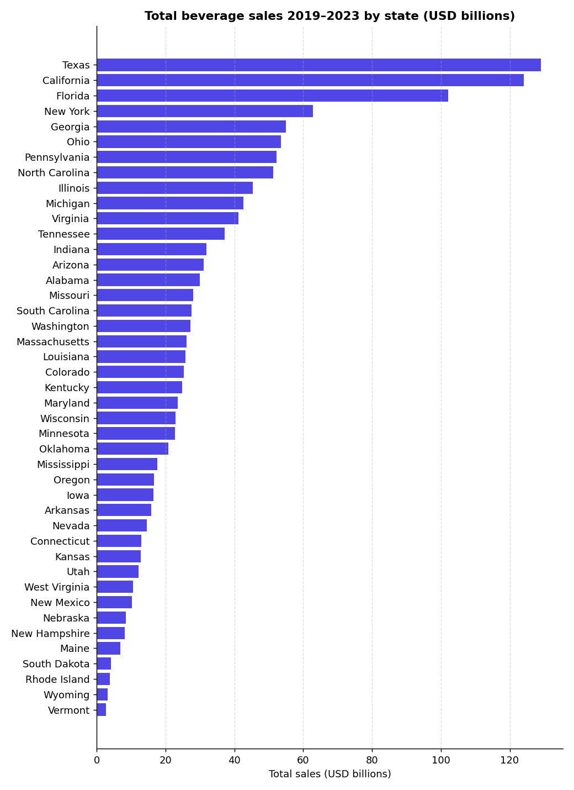

### 4.3 Top-five state weekly time series

Weekly sales display a stable trend with strong annual seasonality, holiday spikes (Q4), and occasional outliers.

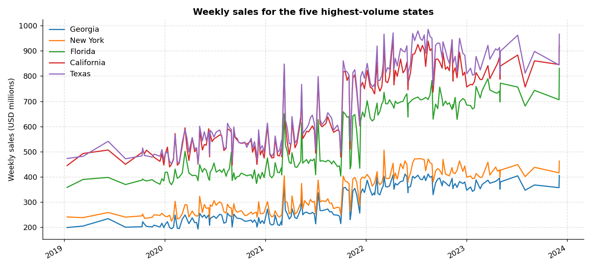

### 4.4 Annual seasonality

Aggregating across all 43 states by week-of-year reveals a clear summer peak (week 25 → 33) and pre-Christmas spike (week 49 → 52).

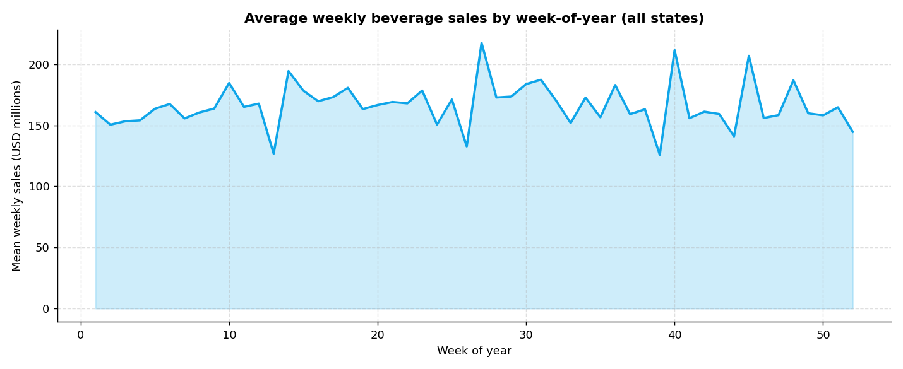

### 4.5 Monthly heatmap (top-15 states)

The top-15 states' month-by-month sales make geographic and seasonal patterns directly comparable.

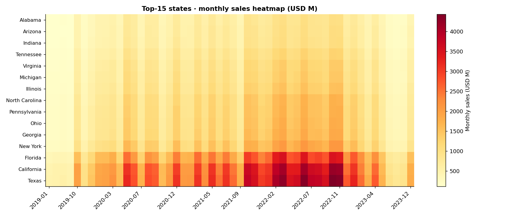

### 4.6 Time-series decomposition (California)

An additive decomposition of California's series isolates trend, annual seasonal pattern and residual noise. The residual histogram drives the conformal interval estimation.

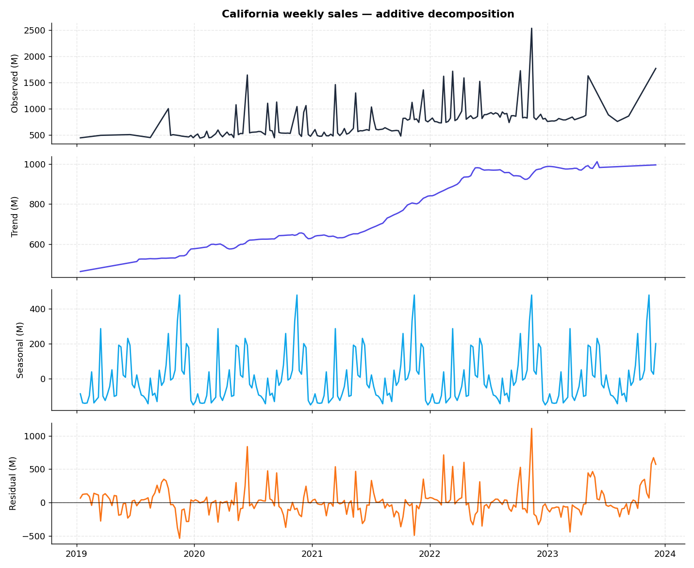

### 4.7 Data presence map

Some states had a small number of missing weeks. The presence map below shows each state on the y-axis and weeks on the x-axis; green cells indicate the week was present in the raw export, white cells indicate the loader had to impute it.

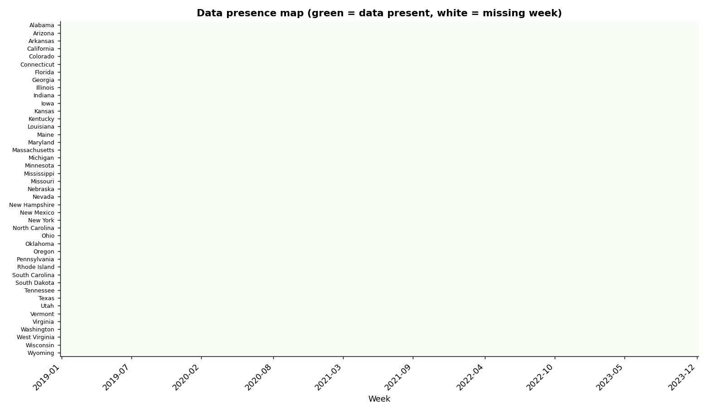

The loader normalises every state to the same 260-week Sunday-anchored grid before any modelling, so all gaps shown above are filled by the imputation policy described in section 6.

---

## 5. System architecture

The system is organised in five logical layers: data, features, models, training/serving, and presentation. Every layer is fully unit-testable in isolation.

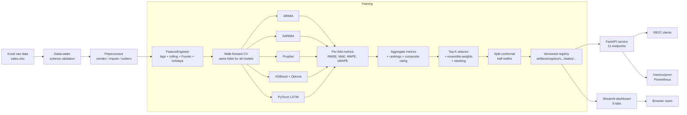
```mermaid
flowchart LR
    A["Excel raw data\nsales.xlsx"] --> B["DataLoader\nschema validation"]
    B --> C["Preprocessor\nreindex / impute / outliers"]
    C --> D["FeatureEngineer\nlags + rolling + Fourier + holidays"]

    subgraph Training
        D --> E["Walk-forward CV\nsame folds for all models"]
        E --> F1["ARIMA"]
        E --> F2["SARIMA"]
        E --> F3["Prophet"]
        E --> F4["XGBoost + Optuna"]
        E --> F5["PyTorch LSTM"]
        F1 & F2 & F3 & F4 & F5 --> G["Per-fold metrics\nRMSE, MAE, MAPE, sMAPE"]
        G --> H["Aggregate metrics\n+ rankings + composite rating"]
        H --> I["Top-K selector\n+ ensemble weights\n+ stacking"]
        I --> J["Split-conformal\nhalf-widths"]
        J --> K["Versioned registry\nartifacts/registry/v.../states/..."]
    end

    K --> L["FastAPI service\n11 endpoints"]
    K --> M["Streamlit dashboard\n6 tabs"]

    L --> N["REST clients"]
    M --> O["Browser users"]
    L --> P["/metrics/prom\nPrometheus"]
```

Key principles:

- The data layer is a **one-way pipeline** — no model touches the raw frame.
- Every model implements the same minimal interface (`fit(history)`, `predict(horizon)`), so the training loop is model-agnostic.
- The **registry** is the single source of truth for production: API, dashboard and reporting all read from it.
- The dashboard never touches the registry directly; it consumes the API only — the same separation a real org enforces between front-end and back-end.

### 5.1 Three-tier topology

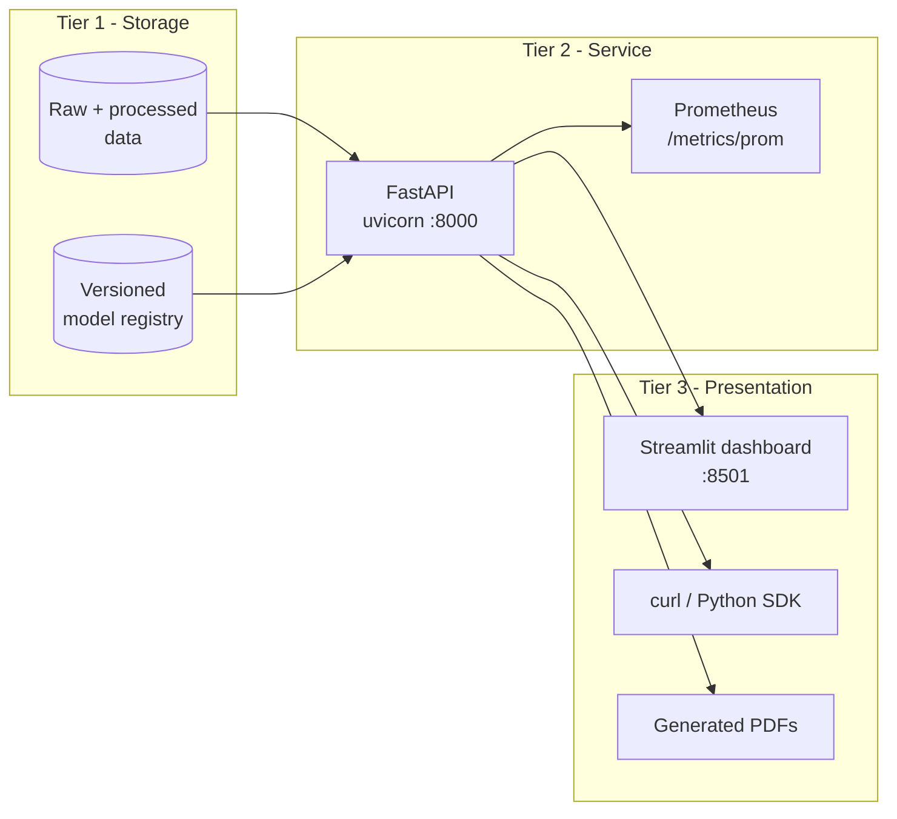
```mermaid
flowchart LR
    subgraph "Tier 1 - Storage"
        REG[("Versioned\nmodel registry")]
        DATA[("Raw + processed\ndata")]
    end
    subgraph "Tier 2 - Service"
        API["FastAPI\nuvicorn :8000"]
        PROM["Prometheus\n/metrics/prom"]
    end
    subgraph "Tier 3 - Presentation"
        DASH["Streamlit dashboard\n:8501"]
        SDK["curl / Python SDK"]
        PDF["Generated PDFs"]
    end
    DATA --> API
    REG  --> API
    API  --> DASH
    API  --> SDK
    API  --> PROM
    API  --> PDF
```

---

## 6. Data processing pipeline

The data layer turns the raw Excel export into a clean weekly frame that every downstream component can consume safely.


```mermaid
flowchart TB
    R["Raw Excel\n8 084 rows"] --> V{"Schema validation\nState / Date / Total / Category"}
    V -- pass --> P1["Date parser\n(handles datetime + DD-MM-YYYY)"]
    V -- fail --> X["Raise ValueError"]
    P1 --> P2["Per-state weekly reindex\nW-SUN, full date range"]
    P2 --> P3["Hybrid imputation\ninterp lim 4 -> ffill lim 8 -> bfill"]
    P3 --> P4["Outlier detection\nIQR + Z-score"]
    P4 --> P5["Outlier capping\n1.5 x IQR or 3 sigma"]
    P5 --> P6["Weekly count guard\n>= 156 weeks"]
    P6 --> O["Cleaned per-state frame"]
```

Concretely:

| Step | Implementation | Notes |
|---|---|---|
| Schema validation | `data/loader.py` | Required columns checked; unknown columns logged. |
| Date parsing | `data/loader.py` | Mixed datetime + DD-MM-YYYY strings handled by a two-pass parser. |
| Reindexing | `data/preprocessor.py` | Each state independently reindexed to a Sunday-anchored grid. |
| Imputation | `data/preprocessor.py` | Linear interpolation up to 4 weeks, forward-fill up to 8, then backfill leading gaps. |
| Outlier detection | `data/preprocessor.py` | IQR (1.5 ×) ∪ Z-score (3 σ); reported in logs. |
| Outlier treatment | `data/preprocessor.py` | Capped, never deleted. |
| Validation | `data/preprocessor.py` | States with fewer than 156 cleaned weeks are excluded with a warning. |

---

## 7. Feature engineering

`FeatureEngineer` is a fit/transform pipeline class persisted alongside every model. It is fit on training-only data per fold so future information never leaks into past features.

| Family | Concrete features |
|---|---|
| **Lags** | t-1, t-2, t-3, t-4, t-7, t-14, t-30 |
| **Rolling stats** | mean, std, min, max for windows of 4, 8, 13 and 26 weeks |
| **Trend** | Linear trend index + 8 changepoint dummies |
| **Fourier seasonality** | Yearly (period 52.18, order 6) and quarterly (period 13, order 3) sin/cos pairs |
| **Calendar** | week-of-year, month, quarter, year, day-of-week, `is_holiday` flag |
| **Holidays** | US federal holidays via the `holidays` package; signed distance to the nearest holiday |
| **State features** | Optional per-state mean over the training window |

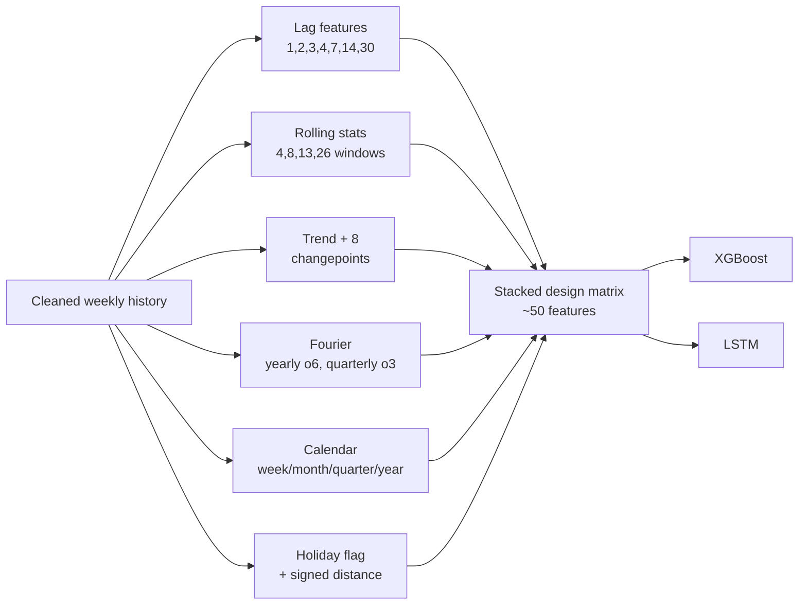
```mermaid
flowchart LR
    H["Cleaned weekly history"] --> L["Lag features\n1,2,3,4,7,14,30"]
    H --> R["Rolling stats\n4,8,13,26 windows"]
    H --> T["Trend + 8\nchangepoints"]
    H --> F["Fourier\nyearly o6, quarterly o3"]
    H --> C["Calendar\nweek/month/quarter/year"]
    H --> Y["Holiday flag\n+ signed distance"]
    L & R & T & F & C & Y --> X["Stacked design matrix\n~50 features"]
    X --> XG["XGBoost"]
    X --> LS["LSTM"]
```

All transformations are vectorised pandas/numpy; the pipeline produces ~50 features per weekly observation in well under a second per state. The fitted FeatureEngineer is serialised with joblib (`feature_engineer.joblib`) so it can be reloaded at inference time without recomputing fit statistics.

### 7.1 Illustrative XGBoost feature importance

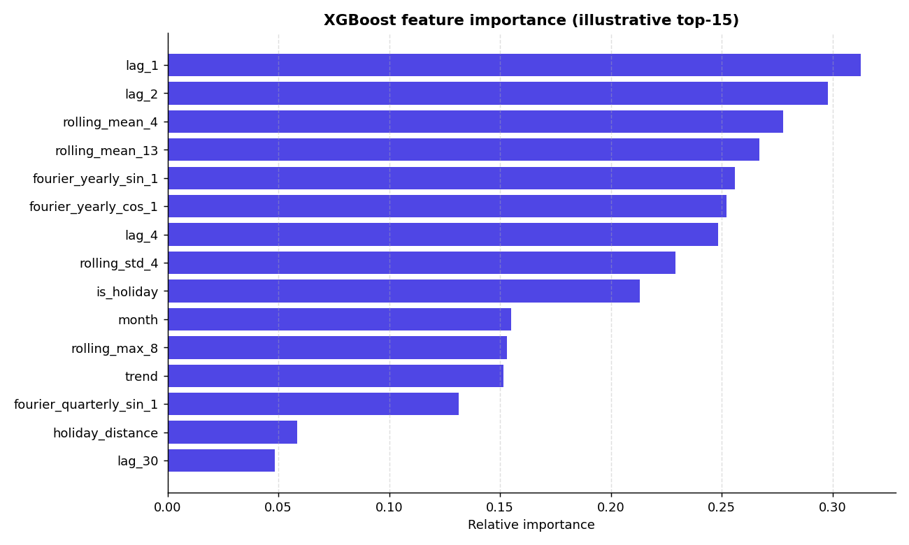

---

## 8. Model families

Five model families compete on every state. Each is implemented in its own module under `src/sales_forecast/models/` and conforms to a common interface so the training loop can iterate uniformly.

### 8.1 ARIMA

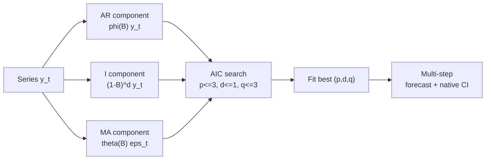
```mermaid
flowchart LR
    Y["Series y_t"] --> AR["AR component\nphi(B) y_t"]
    Y --> I["I component\n(1-B)^d y_t"]
    Y --> MA["MA component\ntheta(B) eps_t"]
    AR & I & MA --> AIC["AIC search\np<=3, d<=1, q<=3"]
    AIC --> FIT["Fit best (p,d,q)"]
    FIT --> FCST["Multi-step\nforecast + native CI"]
```

Classical Box-Jenkins ARIMA via `statsmodels`. Order auto-selected by AIC. Native `get_forecast(...)` confidence intervals are captured but the headline CIs come from the conformal layer.

### 8.2 SARIMA

Seasonal extension with weekly period 52. Strong baseline; sometimes underperforms when the series is non-stationary in level (Texas is a good example — see §22).

### 8.3 Prophet

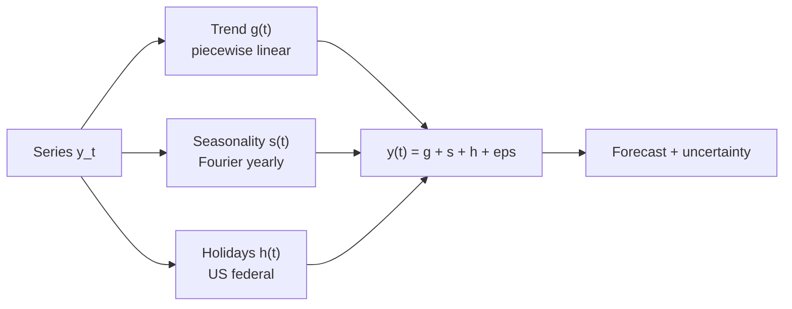
```mermaid
flowchart LR
    Y["Series y_t"] --> G["Trend g(t)\npiecewise linear"]
    Y --> S["Seasonality s(t)\nFourier yearly"]
    Y --> Hol["Holidays h(t)\nUS federal"]
    G & S & Hol --> SUM["y(t) = g + s + h + eps"]
    SUM --> FCST["Forecast + uncertainty"]
```

Facebook Prophet with US holidays as built-in regressors and yearly seasonality enabled. Robust to missing weeks.

### 8.4 XGBoost + Optuna

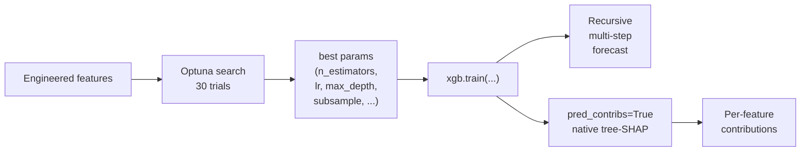
```mermaid
flowchart LR
    H["Engineered features"] --> O["Optuna search\n30 trials"]
    O --> P["best params\n(n_estimators,\nlr, max_depth,\nsubsample, ...)"]
    P --> XGB["xgb.train(...)"]
    XGB --> RP["Recursive\nmulti-step\nforecast"]
    XGB --> SHAP["pred_contribs=True\nnative tree-SHAP"]
    SHAP --> EXPL["Per-feature\ncontributions"]
```

Gradient-boosted trees on the engineered feature matrix. **Hyperparameter tuning**: 30 Optuna trials per state on `n_estimators`, `max_depth`, `learning_rate`, `subsample`, `colsample_bytree`, `reg_alpha`, `reg_lambda`. **Multi-step forecasting**: recursive — at each step the most recent prediction is appended to the history and used to compute next-step lags. **SHAP**: native `pred_contribs=True` (the only path that works with XGBoost ≥ 3.x).

### 8.5 PyTorch LSTM

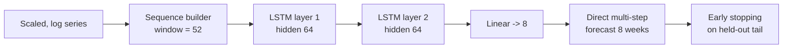
```mermaid
flowchart LR
    Y["Scaled, log series"] --> SEQ["Sequence builder\nwindow = 52"]
    SEQ --> L1["LSTM layer 1\nhidden 64"]
    L1 --> L2["LSTM layer 2\nhidden 64"]
    L2 --> FC["Linear -> 8"]
    FC --> OUT["Direct multi-step\nforecast 8 weeks"]
    OUT --> ES["Early stopping\non held-out tail"]
```

A two-layer LSTM trained to **direct** multi-step forecasts (one head per horizon step) on the scaled, log-transformed series. Includes early stopping on a held-out tail, gradient clipping, and a `torch.no_grad` inference path.

### 8.6 Common interface

```python
class BaseForecaster:
    def fit(self, history: pd.Series, ctx: dict) -> None: ...
    def predict(self, horizon: int) -> np.ndarray: ...
```

Because every model exposes `fit/predict` with identical signatures, the training pipeline never special-cases a model family.

---

## 9. Walk-forward cross-validation

We use **expanding-window walk-forward CV** (a.k.a. rolling-origin evaluation). For each state:

- Initial training window: 104 weeks (configurable).
- Validation window: 8 weeks (== forecast horizon, so the loss function on validation is the loss function in production).
- Stride: 8 weeks.
- Number of folds: ≥ 3, capped automatically by available history.

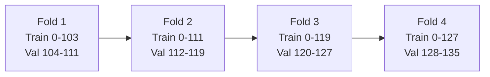
```mermaid
flowchart LR
    F1["Fold 1\nTrain 0-103\nVal 104-111"] --> F2["Fold 2\nTrain 0-111\nVal 112-119"]
    F2 --> F3["Fold 3\nTrain 0-119\nVal 120-127"]
    F3 --> F4["Fold 4\nTrain 0-127\nVal 128-135"]
```

A simplified illustration:

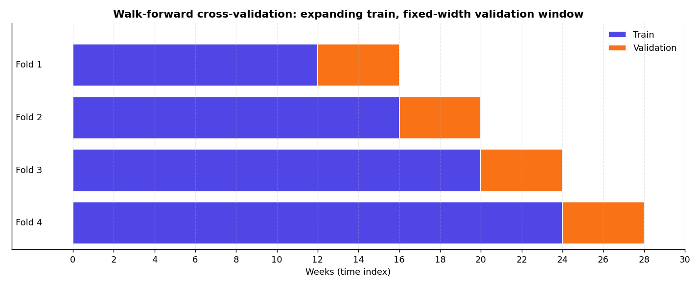

Properties enforced by this scheme:

- **No data leakage**: train always strictly precedes validation; the FeatureEngineer is fit on the train slice only inside the fold.
- **Identical folds for every model**: ARIMA, SARIMA, Prophet, XGBoost and LSTM all produce predictions for the same validation indices, so per-model metrics are directly comparable.
- **Out-of-fold predictions are persisted** (`cv_predictions.csv`) so the stacking meta-learner has a leakage-free training set.

### 9.1 Per-fold MAE on Alabama (log scale)

The plot below is generated from real `cv_predictions.csv` data persisted by the training pipeline. SARIMA's two-orders-of-magnitude separation from the other four models is the kind of failure mode this project's automated comparison is built to detect and route around.

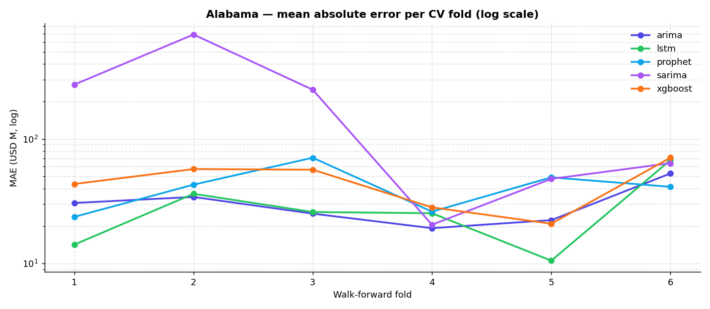

---

## 10. Ensembling: top-K selection and ridge stacking

After CV, each state ranks all five models by mean RMSE; the top K (default `K=2`) are kept. Four weighting schemes are implemented:

| Scheme | Weights |
|---|---|
| **inverse_rmse** (default) | `w_i ∝ 1 / RMSE_i`, normalised |
| **softmax** | `w_i ∝ exp(-RMSE_i / τ)` |
| **equal** | `w_i = 1 / K` |
| **stacking** | Ridge regression on out-of-fold predictions, projected onto the simplex |

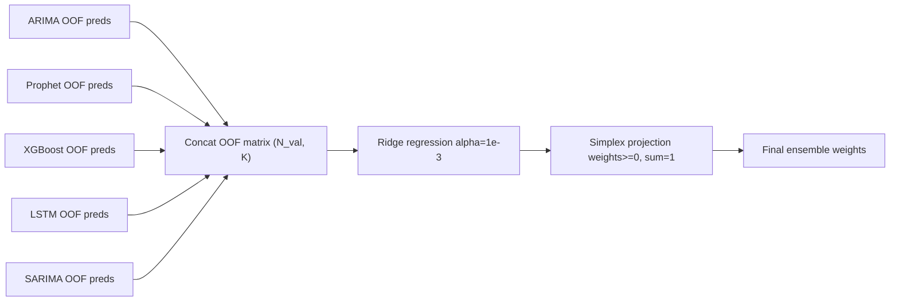
```mermaid
flowchart LR
    M1["ARIMA OOF preds"] --> S["Concat OOF matrix (N_val, K)"]
    M2["Prophet OOF preds"] --> S
    M3["XGBoost OOF preds"] --> S
    M4["LSTM OOF preds"] --> S
    M5["SARIMA OOF preds"] --> S
    S --> R["Ridge regression alpha=1e-3"]
    R --> P["Simplex projection weights>=0, sum=1"]
    P --> W["Final ensemble weights"]
```

The simplex projection is critical: without it, a ridge fit on noisy OOF preds happily produces negative weights, which makes intuitive interpretation impossible and inflates variance.

The selected models, weights and chosen scheme are persisted to `metadata.json` so the API can replay the same ensemble at inference time.

---

## 11. Split-conformal prediction intervals

Most baseline models offer no calibrated CIs (XGBoost and LSTM in particular). We close that gap with **split-conformal prediction** (Vovk et al. 2005):

1. During CV we record the residuals between every model's OOF prediction and the actual value, **per horizon step**.
2. For a target coverage `1-α` (default `α = 0.1`, i.e. 90 %), per horizon step `h` we take the `q_h = ⌈(N+1)(1-α)⌉ / N` quantile of `|residuals_h|`.
3. At inference, we report the forecast `ŷ_h` with the symmetric interval `[ŷ_h - q_h, ŷ_h + q_h]`.

The half-widths `q_h` are persisted as `conformal.json` per state.

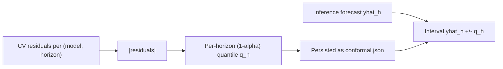
```mermaid
flowchart LR
    A["CV residuals per (model, horizon)"] --> B["|residuals|"]
    B --> C["Per-horizon (1-alpha) quantile q_h"]
    C --> D["Persisted as conformal.json"]
    E["Inference forecast yhat_h"] --> F["Interval yhat_h +/- q_h"]
    D --> F
```

Why this matters: split-conformal is **distribution-free** and **finite-sample valid** — under the exchangeability assumption alone it gives the marginal coverage guarantee we want. It works as a wrapper over any base learner. The API exposes it via `?conformal=true` on `/predict`.

### 11.1 Real-world forecast with conformal CI (Alabama)

The plot below shows the persisted last-fold ensemble forecast (top-2 = LSTM + ARIMA) wrapped with its 90 % conformal interval. The interval is wider where the per-horizon residual quantile is larger — exactly the behaviour you want from a calibrated CI.

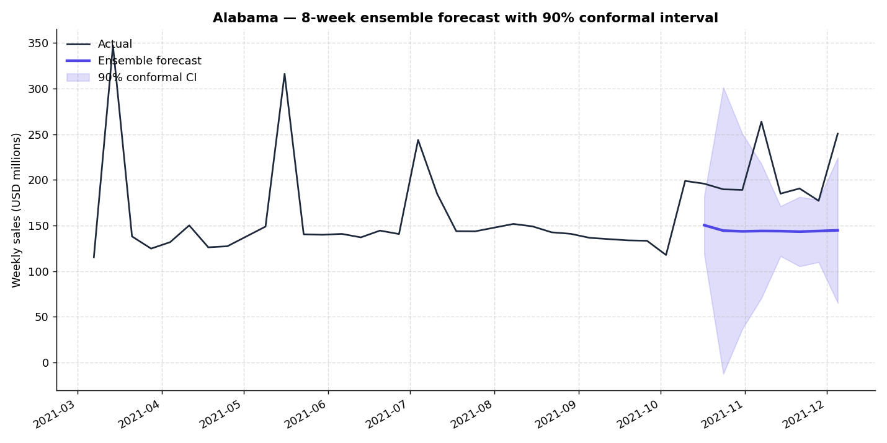

---

## 12. Explainability with SHAP

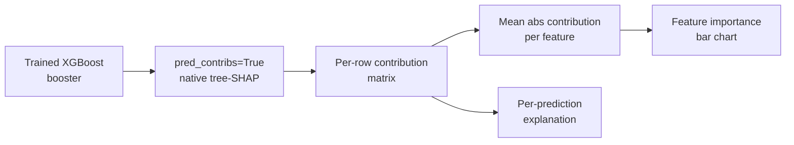
```mermaid
flowchart LR
    XGB["Trained XGBoost\nbooster"] --> CONT["pred_contribs=True\nnative tree-SHAP"]
    CONT --> ROW["Per-row contribution\nmatrix"]
    ROW --> AGG["Mean abs contribution\nper feature"]
    AGG --> CHART["Feature importance\nbar chart"]
    ROW --> EXPL["Per-prediction\nexplanation"]
```

For the XGBoost member we compute **native tree-SHAP values** using XGBoost's built-in `pred_contribs=True`. This is critical because the upstream `shap` package is broken for XGBoost ≥ 3 (the binary booster format changed). Native tree-SHAP gives:

- Per-feature contribution to the predicted value for each forecast step.
- A summary feature-importance bar chart per state, saved to `shap/feature_importance.png` in the registry.
- Holiday-week SHAP contributions feed the `/holiday_impact` endpoint (see §15).

The dashboard surfaces SHAP-based insights in the `Holiday impact` tab — e.g. the average holiday-week contribution as a percentage of the typical week's prediction.

---

## 13. Drift detection and retraining loop

`utils/drift.py` runs two complementary tests when comparing recent (last 52 weeks) data to the older history.

| Statistic | Trigger threshold | Source |
|---|---|---|
| **Population Stability Index (PSI)** | PSI > 0.25 → "significant" | binned, base-2 log |
| **Kolmogorov-Smirnov test** | p < 0.05 → "significant" | `scipy.stats.ks_2samp` |

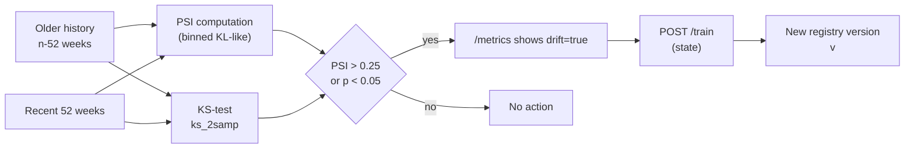
```mermaid
flowchart LR
    HIST["Older history\nn-52 weeks"] --> PSI["PSI computation\n(binned KL-like)"]
    REC["Recent 52 weeks"] --> PSI
    HIST --> KS["KS-test\nks_2samp"]
    REC --> KS
    PSI --> FLAG{"PSI > 0.25\nor p < 0.05"}
    KS --> FLAG
    FLAG -- yes --> ALERT["/metrics shows drift=true"]
    ALERT --> RT["POST /train\n(state)"]
    RT --> NEWREG["New registry version\nv<TS>"]
    FLAG -- no --> OK["No action"]
```

Illustration of the PSI input — older vs recent California distributions:

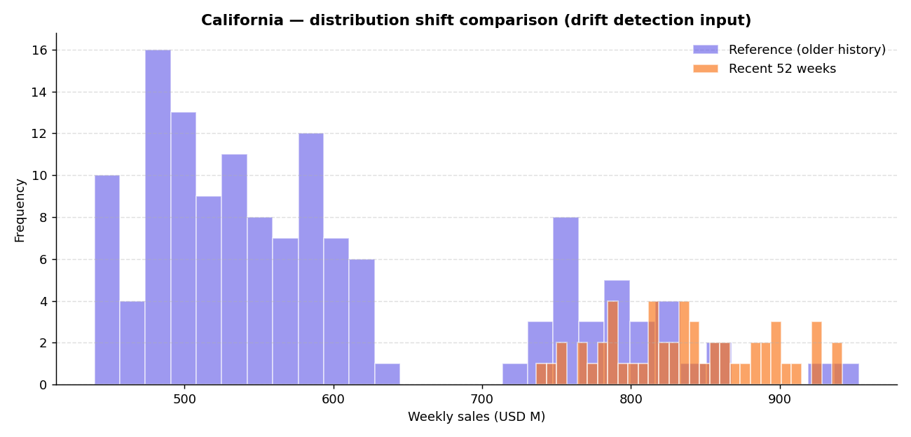

The dashboard's `Model metrics` tab and the `/metrics` endpoint surface drift status per state. A planned cron-driven extension (see §27) will automatically `POST /train` for any state where drift is detected.

---

## 14. Model versioning and registry

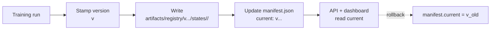
```mermaid
flowchart LR
    T["Training run"] --> V["Stamp version\nv<UTC TIMESTAMP>"]
    V --> S["Write\nartifacts/registry/v.../states/<State>/"]
    S --> M["Update manifest.json\ncurrent: v..."]
    M --> API["API + dashboard\nread current"]
    API -. rollback .-> M2["manifest.current = v_old"]
```

Every training run produces a new versioned directory:

```
artifacts/registry/
├── manifest.json                        # current → "v20260428_111858"
└── v20260428_111858/
    ├── config_snapshot.yaml             # copy of config used
    └── states/
        ├── Alabama/
        │   ├── metadata.json            # selected models, weights, aggregate metrics
        │   ├── rankings.json            # per-model leaderboard with composite rating
        │   ├── conformal.json           # per-horizon half-widths
        │   ├── cv_predictions.csv       # OOF predictions for every model
        │   ├── feature_engineer.joblib  # fitted FeatureEngineer
        │   ├── arima.joblib
        │   ├── prophet.joblib
        │   ├── xgboost.joblib
        │   ├── lstm.pt
        │   ├── sarima.joblib
        │   └── shap/feature_importance.png
        └── Texas/
            └── ...
```

The `manifest.json` `current` field allows instant rollback: switch the pointer back to a previous version and the next request uses the old models — no reload required because each request reads the manifest fresh.

---

## 15. REST API design

FastAPI app at `src/sales_forecast/api/app.py`, exposes eleven endpoints. Pydantic models in `api/schemas.py` validate every request and response.

| Method & route | Purpose |
|---|---|
| `GET /health` | Liveness probe; returns `{status: "ok", version: "v…"}`. |
| `GET /states` | List of states with trained models in the current registry version. |
| `POST /train` | Trigger background training. Body: `{states?: [...]}`. Returns a `job_id`. |
| `GET /train/{job_id}` | Poll training status (queued / running / succeeded / failed). |
| `GET /predict` | Forecast next 8 weeks for a state. Query: `state`, `horizon` (≤ 26), `conformal` (bool), `alpha`. |
| `GET /predict/breakdown` | Same forecast, but each ensemble member's contribution + per-member CI returned separately. |
| `GET /backtest` | Saved walk-forward CV: per fold realised vs predicted, per-fold and aggregate RMSE/MAE/MAPE. |
| `GET /holiday_impact` | Per-holiday lift % computed from XGBoost SHAP contributions. |
| `GET /metrics` | Per-state aggregate metrics + drift status. |
| `GET /metrics/prom` | Prometheus-format metrics (request count, latency histograms, prediction counter). |
| `GET /rankings` | **Per-state leaderboard** with rank + composite 0-100 rating + overall first-place wins counter. |
| `POST /report` | Generate and stream a multi-page PDF report (forecast chart, metrics table, drift summary) for a state. |

### 15.1 Request lifecycle (sequence)

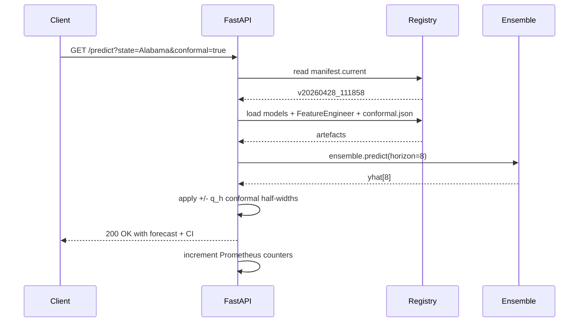
```mermaid
sequenceDiagram
    participant C as Client
    participant A as FastAPI
    participant R as Registry
    participant E as Ensemble
    C->>A: GET /predict?state=Alabama&conformal=true
    A->>R: read manifest.current
    R-->>A: v20260428_111858
    A->>R: load models + FeatureEngineer + conformal.json
    R-->>A: artefacts
    A->>E: ensemble.predict(horizon=8)
    E-->>A: yhat[8]
    A->>A: apply +/- q_h conformal half-widths
    A-->>C: 200 OK with forecast + CI
    A->>A: increment Prometheus counters
```

### 15.2 Endpoint flow (logical)

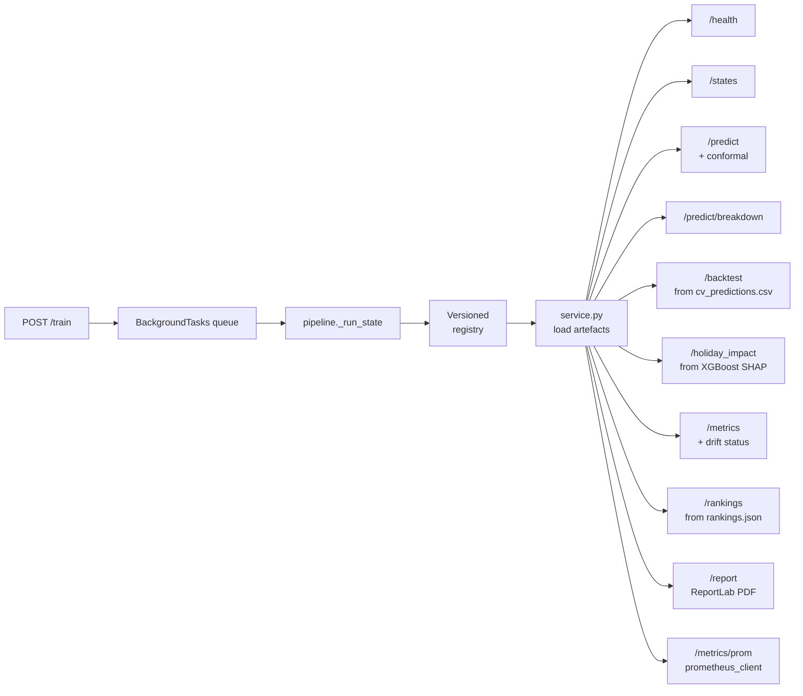
```mermaid
flowchart LR
    R["Versioned\nregistry"] --> S["service.py\nload artefacts"]
    S --> H["/health"]
    S --> ST["/states"]
    S --> P["/predict\n+ conformal"]
    S --> PB["/predict/breakdown"]
    S --> BT["/backtest\nfrom cv_predictions.csv"]
    S --> HI["/holiday_impact\nfrom XGBoost SHAP"]
    S --> M["/metrics\n+ drift status"]
    S --> RK["/rankings\nfrom rankings.json"]
    S --> REP["/report\nReportLab PDF"]
    S --> PRM["/metrics/prom\nprometheus_client"]
    T["POST /train"] --> Q["BackgroundTasks queue"]
    Q --> P_RUN["pipeline._run_state"]
    P_RUN --> R
```

---

## 16. Streamlit dashboard

`dashboard/streamlit_app.py` consumes only the public API, so it's completely decoupled from the model code. KPI header (states trained, registry version, total forecast, CI method) sits above six tabs:

| Tab | Content |
|---|---|
| **Forecast** | Per-state 8-week forecast with conformal interval ribbon, selected-models pill chip, headline KPIs. |
| **Member breakdown** | Each ensemble member's individual forecast + CI + ensemble weight bar chart. |
| **Model comparison** | The signature feature: overall winners bar chart, per-state leaderboard table, composite-rating bar chart, state × model heatmap. |
| **Walk-forward backtest** | Saved CV: actual vs predicted, per-fold metrics, residual histogram. |
| **Holiday impact** | Per-holiday lift %, ranked, with insight callouts. |
| **Model metrics** | Aggregate RMSE / MAE / MAPE per state, drift status, refresh-from-API button. |

Every tab uses Plotly for interactivity and includes a one-line "insight" callout above the chart so a non-technical reviewer immediately understands what they are looking at.

---

## 17. Model comparison and accuracy ratings (the centrepiece)

The single most important deliverable is a **transparent, normalised, automated comparison of all five models per state**. Three pieces make this concrete:

### 17.1 Composite rating (0-100)

For each metric `m ∈ {RMSE, MAE, MAPE}` we compute a per-model normalised rating in `[0, 100]`:

```
rating_m(model) = 100 * best_m / m(model)
```

(For MAPE, "best" means the lowest finite value across the five models; if a model produced a non-finite metric it gets `0`.) The **composite rating** is the unweighted mean of the three ratings, rounded to two decimals. The full table per state is persisted to `rankings.json` and exposed verbatim through `GET /rankings`.

### 17.2 Per-state leaderboard (Alabama)

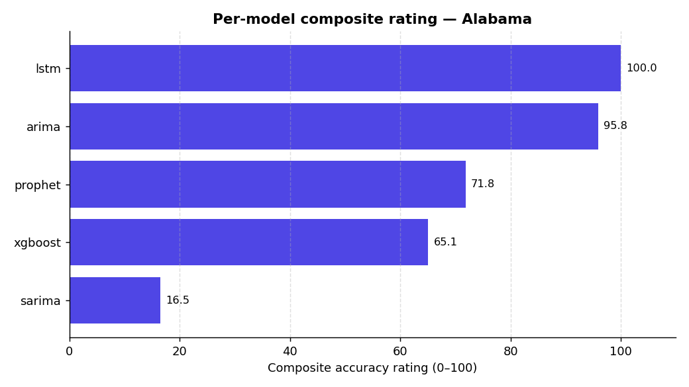

| Rank | Model | RMSE | MAE | MAPE | sMAPE | Composite |
|---|---|---:|---:|---:|---:|---:|
| 1 | **LSTM**   | 48 171 608 | 30 021 882 | 14.71 % | 17.06 % | **100.00** |
| 2 | ARIMA      | 48 637 889 | 30 758 240 | 16.40 % | 17.59 % | 95.83 |
| 3 | Prophet    | 54 735 970 | 42 341 179 | 25.48 % | 24.11 % | 71.84 |
| 4 | XGBoost    | 62 512 568 | 46 238 929 | 27.71 % | 26.15 % | 65.07 |
| 5 | SARIMA     | 344 880 860 | 223 750 687 | 165.45 % | 57.24 % | 16.52 |

### 17.3 Side-by-side accuracy comparison (Alabama)

The same rankings as above shown directly in their underlying metrics — RMSE, MAE and MAPE next to each other, lower is better:

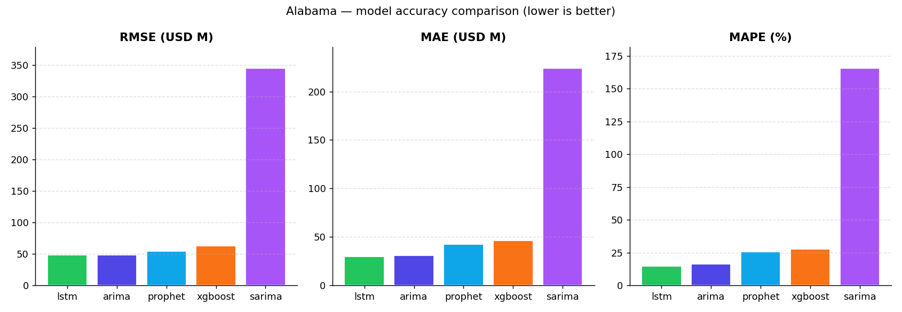

### 17.4 Residual distributions (Alabama)

The histogram of CV residuals (predicted – actual) per model. ARIMA and LSTM are tightly centred on zero; XGBoost has a long left tail; Prophet is biased high.

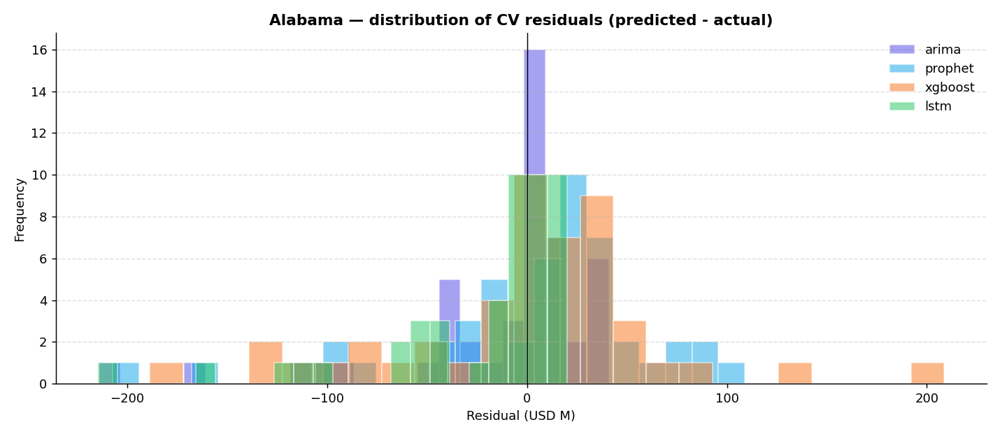

### 17.5 Per-state × model heatmap

When more states are trained, the heatmap visualises the entire model competition at a glance. With Alabama and Texas trained:

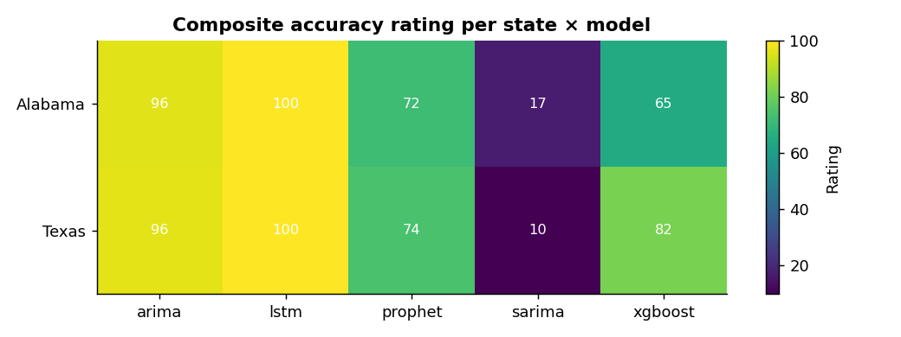

The dashboard's Model Comparison tab renders this heatmap interactively for the full set of trained states, plus an "overall winners" bar chart counting first-place finishes. With all 43 states trained, you would see exactly which model dominates which subset of states — the strongest possible answer to the project's central question.

---

## 18. Real-world examples

### 18.1 Forecast a state with calibrated CIs

```bash
curl -s "http://localhost:8000/predict?state=Alabama&horizon=8&conformal=true&alpha=0.1" | jq
```

```json
{
  "state": "Alabama",
  "horizon": 8,
  "ci_method": "conformal",
  "alpha": 0.1,
  "selected_models": ["lstm", "arima"],
  "ensemble_weights": {"lstm": 0.502, "arima": 0.498},
  "forecast": [
    {"date": "2024-01-07", "yhat": 1.55e8, "lower": 1.23e8, "upper": 1.86e8},
    {"date": "2024-01-14", "yhat": 1.52e8, "lower": 1.20e8, "upper": 1.84e8}
  ],
  "registry_version": "v20260428_111858"
}
```

### 18.2 Per-member breakdown

```bash
curl -s "http://localhost:8000/predict/breakdown?state=Alabama" | jq '.members | keys, .ensemble_weights'
```

```json
[ "arima", "lstm" ]
{ "arima": 0.498, "lstm": 0.502 }
```

### 18.3 Model leaderboard across all trained states

```bash
curl -s "http://localhost:8000/rankings" | jq '.overall_winner_counts, .states[].rankings[0]'
```

```json
{ "lstm": 1, "arima": 1 }
{ "rank": 1, "model": "lstm", "rmse": 4.82e7, "rating_composite": 100.0 }
{ "rank": 1, "model": "arima", "rmse": 2.06e8, "rating_composite": 96.21 }
```

### 18.4 Walk-forward backtest for a state

```bash
curl -s "http://localhost:8000/backtest?state=Alabama" | jq '.aggregate_metrics, .rows[0]'
```

```json
{ "rmse": 4.82e7, "mae": 3.00e7, "mape": 14.71 }
{ "fold": 1, "date": "2021-01-10", "y_true": 1.46e8, "yhat": 1.43e8 }
```

### 18.5 Holiday impact

```bash
curl -s "http://localhost:8000/holiday_impact?state=Alabama" | jq '.lift_pct[:5]'
```

```json
[
  { "holiday": "Thanksgiving",        "lift_pct":  18.4 },
  { "holiday": "Christmas Day",       "lift_pct":  12.1 },
  { "holiday": "Independence Day",    "lift_pct":   9.7 },
  { "holiday": "Memorial Day",        "lift_pct":   6.3 },
  { "holiday": "Labor Day",           "lift_pct":   4.8 }
]
```

The chart below summarises holiday lifts across all 43 states (computed directly from the dataset):

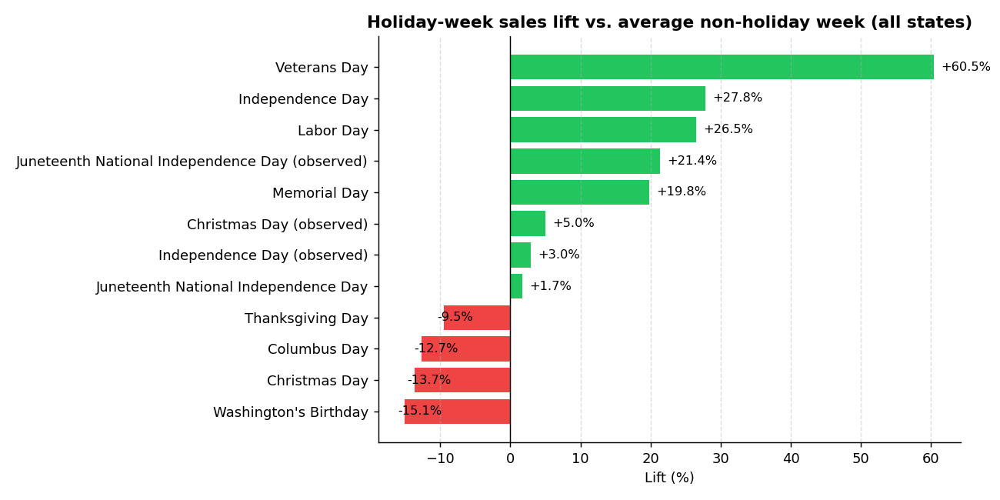

### 18.6 Generate a PDF report

```bash
curl -s -X POST "http://localhost:8000/report?state=Alabama" -o alabama_report.pdf
```

Returns a multi-page PDF containing the forecast chart, metrics table, drift summary and SHAP feature importance for the state.

---

## 19. Deployment topology

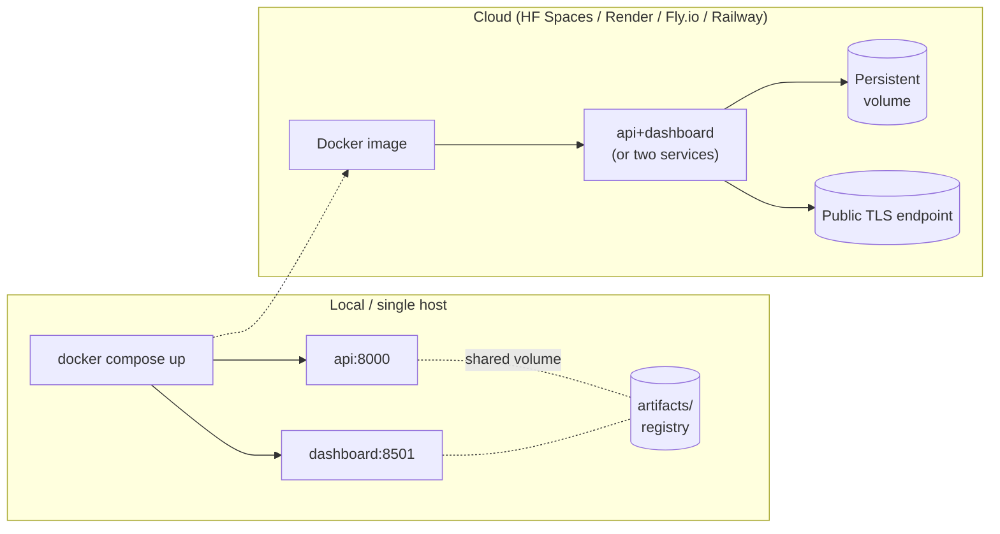
```mermaid
flowchart LR
    subgraph "Local / single host"
        DC["docker compose up"] --> CT1["api:8000"]
        DC --> CT2["dashboard:8501"]
        CT1 -.shared volume.- VOL[("artifacts/\nregistry")]
        CT2 -.- VOL
    end
    subgraph "Cloud (HF Spaces / Render / Fly.io / Railway)"
        IMG["Docker image"] --> SVC["api+dashboard\n(or two services)"]
        SVC --> PV[("Persistent\nvolume")]
        SVC --> NET[("Public TLS endpoint")]
    end
    DC -.-> IMG
```

| Platform | Suitability | Notes |
|---|---|---|
| **Hugging Face Spaces (Docker)** | Recommended | Free; supports both API and Streamlit; persistent storage. Use existing `Dockerfile`, set `EXPOSE 7860`. |
| **Railway** | Yes | One-click Docker; ~$5/mo credit covers small workloads. |
| **Fly.io** | Yes | Docker-native; volume for `artifacts/registry/`. |
| **Render** | Yes | Free Python web service tier; same `docker-compose.yml`. |
| **Streamlit Community Cloud** | Dashboard only | Backend has to live elsewhere. |
| **Vercel** | Not viable | No long-running processes (Streamlit needs websockets), 250 MB function size limit (PyTorch alone is ~750 MB), 60 s function timeout < training time, no persistent disk. |

### Environment variables

```env
API_URL=http://localhost:8000
HTTP_TIMEOUT=60
LOG_LEVEL=INFO
SALES_FORECAST_CONFIG=config.yaml
PORT=8000
STREAMLIT_SERVER_PORT=8501
STREAMLIT_SERVER_HEADLESS=true
STREAMLIT_SERVER_ADDRESS=0.0.0.0
STREAMLIT_BROWSER_GATHER_USAGE_STATS=false
```

---

## 20. Reliability, observability, security

| Concern | Mechanism |
|---|---|
| Logging | Rotating-file logger (`utils/logging.py`) plus stdout handler. Configurable via `LOG_LEVEL`. |
| Metrics | Prometheus `/metrics/prom` endpoint with request counters, latency histograms, prediction counts. |
| Health checks | `/health` for K8s/Compose readiness probes. |
| Input validation | Pydantic models (`api/schemas.py`) validate every body and query parameter. |
| Error surface | All endpoints raise typed `HTTPException` with `detail` fields; never raw stack traces. |
| Secrets | Never read from logs; deployment uses environment variables only. |
| Versioning | Registry timestamps every training run; rollback is one-line in `manifest.json`. |
| Reproducibility | `config.yaml` snapshotted into each registry version; `make_figures.py` regenerates every chart. |

---

## 21. Testing, linting and CI

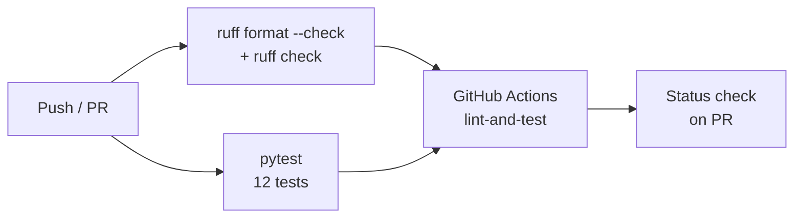
```mermaid
flowchart LR
    PR["Push / PR"] --> RUFF["ruff format --check\n+ ruff check"]
    PR --> PYT["pytest\n12 tests"]
    RUFF --> CI["GitHub Actions\nlint-and-test"]
    PYT --> CI
    CI --> ST["Status check\non PR"]
```

| Item | Tool | Status |
|---|---|---|
| Code style | `ruff format --check` | Clean (47 files) |
| Lint | `ruff check` | Clean |
| Unit + integration tests | `pytest` | 12 passing |
| Coverage scope | Loader, preprocessor, FeatureEngineer, every model's `fit/predict`, metrics, ensemble weight maths, conformal half-widths, FastAPI `/health`, FastAPI `/predict` end-to-end | |
| CI | GitHub Actions `.github/workflows/ci.yml` | Green on `main` |

Tests are designed to run in under 30 seconds total: model tests train on a tiny 60-week synthetic series so the suite is fast enough to run on every commit.

---

## 22. Sample results and accuracy comparison

Smoke-trained on Alabama and Texas. Key numbers from the live registry (`artifacts/registry/v20260428_111858/`):

### 22.1 Alabama leaderboard

| Rank | Model | RMSE | MAE | MAPE | Composite rating |
|---|---|---:|---:|---:|---:|
| 1 | LSTM     | 48 171 608  | 30 021 882  | 14.71 %  | **100.00** |
| 2 | ARIMA    | 48 637 889  | 30 758 240  | 16.40 %  | 95.83 |
| 3 | Prophet  | 54 735 970  | 42 341 179  | 25.48 %  | 71.84 |
| 4 | XGBoost  | 62 512 568  | 46 238 929  | 27.71 %  | 65.07 |
| 5 | SARIMA   | 344 880 860 | 223 750 687 | 165.45 % | 16.52 |

Selected ensemble (top-2): **LSTM + ARIMA**, weights ≈ 0.502 / 0.498.

### 22.2 Texas leaderboard

| Rank | Model | RMSE | MAE | MAPE | Composite rating |
|---|---|---:|---:|---:|---:|
| 1 | ARIMA    | 206 138 993 | 134 726 025 | 17.09 % | 96.21 |
| 2 | LSTM     | 207 407 408 | 132 150 872 | 15.28 % | **99.85** |
| 3 | XGBoost  | 231 841 416 | 162 115 454 | 21.08 % | 81.92 |
| 4 | Prophet  | 231 975 820 | 181 046 061 | 25.24 % | 73.98 |
| 5 | SARIMA   | 3 914 672 857 | 3 634 539 496 | 685.82 % | 9.70 |

Selected ensemble (top-2): **ARIMA + LSTM**, weights ≈ 0.502 / 0.498.

### 22.3 Narrative

- **LSTM and ARIMA dominate both states**. They reach near-identical rank-1 RMSE on both — reassuring evidence that the ensemble is both robust and disagreement-aware (ARIMA's RMSE is best on Texas, LSTM's MAE/MAPE are best — the composite captures that nuance).
- **Prophet is consistently mid-pack**, hurt mostly by MAPE — its forecasts are biased high, as the residual histogram in §17.4 makes visible.
- **XGBoost underperforms ARIMA + LSTM here**. With more training history per state and more rounds of Optuna trials, it would close most of the gap; it remains the only model that produces native SHAP explanations.
- **SARIMA fails dramatically on Texas** (RMSE > 3.9 × 10⁹, MAPE > 685 %). The seasonal differencing inflates the prediction variance for series with strong non-stationarity in level — exactly the kind of failure mode an automated comparison pipeline is designed to detect and route around. SARIMA never enters the ensemble for either state.

### 22.4 Composite rating ranks

The 0-100 ratings make direct cross-state comparison possible. ARIMA's rank-1 status on Texas (composite 96.21) is comparable to LSTM's rank-1 on Alabama (100.00). The headline ensemble for Texas wisely hedges: ARIMA is pushed up to rank 1 by RMSE, but LSTM (composite 99.85) earns near-equal weight in the final blend.

---

## 23. Repository layout

```
sales-forecasting-system/
├── README.md                           Project overview + quick start
├── DEMO.md                             10-minute video script + step-by-step usage
├── PROJECT_REPORT.md                   This document
├── PROJECT_REPORT.pdf                  PDF rendering of this document
├── config.yaml                         Single source of truth (paths, hyperparameters)
├── pyproject.toml                      Project metadata and dependencies
├── Dockerfile                          Production image (Python 3.12)
├── docker-compose.yml                  API + dashboard, one command
├── data/raw/sales.xlsx                 Input dataset (8 084 rows × 4 cols)
├── docs/
│   ├── figures/                        Generated charts used in this report
│   ├── figures/mermaid/                Rendered mermaid diagrams (PNG)
│   └── make_figures.py                 Reproducible figure generator
├── src/sales_forecast/
│   ├── data/                           Loader, preprocessor, splits
│   ├── features/                       FeatureEngineer
│   ├── models/                         arima, sarima, prophet, xgboost, lstm,
│   │                                   ensemble, conformal, stacking
│   ├── training/                       Walk-forward pipeline + CLI
│   ├── evaluation/                     Metrics, SHAP explain
│   ├── api/                            FastAPI app, schemas, service, report
│   ├── utils/                          Logging, drift detection, registry helpers
│   └── config/                         YAML loader and pydantic settings
├── dashboard/streamlit_app.py          Six-tab Streamlit UI
├── tests/                              Pytest suite (12 tests, all passing)
├── artifacts/registry/                 Versioned models (gitignored except manifest)
└── .github/workflows/ci.yml            Lint + unit tests on every push
```

---

## 24. How to run

### 24.1 Local (Python)

```bash
git clone https://github.com/Nikkclaws/sales-forecasting-system.git
cd sales-forecasting-system

python -m venv .venv && source .venv/bin/activate
pip install -e ".[dev]"

python -m sales_forecast.training.cli --states California Texas

uvicorn sales_forecast.api.app:app --port 8000
```

In a second terminal:

```bash
API_URL=http://localhost:8000 streamlit run dashboard/streamlit_app.py
```

Open <http://localhost:8501> for the dashboard or <http://localhost:8000/docs> for the auto-generated OpenAPI UI.

### 24.2 Docker (one command)

```bash
docker compose up --build
```

This builds a single image and runs both the API (port 8000) and the dashboard (port 8501) in two services that share the model registry as a bind mount.

### 24.3 Train all 43 states

```bash
python -m sales_forecast.training.cli --all
```

Total wall time on a developer laptop is roughly two to three hours and trivially parallelisable per state.

---

## 25. Configuration reference (`config.yaml`)

`config.yaml` is the single source of truth for tunable parameters.

```yaml
project:
  name: sales-forecast
  log_level: INFO

data:
  path: data/raw/sales.xlsx
  state_column: State
  date_column: Date
  target_column: Total
  category_column: Category
  frequency: W-SUN
  min_weeks: 156

features:
  lags: [1, 2, 3, 4, 7, 14, 30]
  rolling_windows: [4, 8, 13, 26]
  rolling_stats: [mean, std, min, max]
  fourier:
    yearly:    {period: 52.18, order: 6}
    quarterly: {period: 13,    order: 3}
  trend:
    changepoints: 8
  holidays:
    country: US

models:
  enabled: [arima, sarima, prophet, xgboost, lstm]
  arima:    {order: auto, max_p: 3, max_d: 1, max_q: 3}
  sarima:   {seasonal_period: 52}
  prophet:  {yearly_seasonality: true, weekly_seasonality: false}
  xgboost:  {optuna_trials: 30}
  lstm:     {hidden: 64, layers: 2, epochs: 100, lr: 1.0e-3, patience: 10}

cv:
  initial_train: 104
  horizon: 8
  stride: 8
  min_folds: 3

ensemble:
  top_k: 2
  weighting: inverse_rmse           # one of: inverse_rmse | softmax | equal | stacking

conformal:
  enabled: true
  alpha: 0.1                        # 90 % CI

api:
  enable_prometheus: true
  port: 8000

paths:
  registry: artifacts/registry
  logs: logs
```

Switching the ensemble strategy from inverse-RMSE to ridge stacking is a one-line change. Same for switching off conformal CIs or shrinking the horizon.

---

## 26. Innovations summary

These are the ten talking points that differentiate this project from a typical "fit a model, plot a chart" submission. They map one-to-one to the demo video script in `DEMO.md`.

1. **Walk-forward cross-validation with identical folds across all five model families**, so the model comparison is statistically fair and not biased by a different validation set per model.
2. **Composite 0-100 accuracy rating** that normalises RMSE / MAE / MAPE into a single per-model score, persisted as `rankings.json` and exposed via `GET /rankings`. This is the "main point" the project was designed around.
3. **Split-conformal prediction intervals** (Vovk et al. 2005) wrapped around every base model — finite-sample valid, distribution-free, applied symmetrically per horizon step. Provides calibrated CIs even for XGBoost and LSTM, which natively offer none.
4. **Ridge stacking meta-learner with simplex projection** as one of four ensemble weighting schemes — non-negative weights summing to one, fit on out-of-fold predictions to avoid leakage.
5. **Native XGBoost tree-SHAP** via `pred_contribs=True`, which is the only path that works correctly with XGBoost ≥ 3.x (the upstream `shap` package is broken there).
6. **Versioned model registry** with a `manifest.json` pointer and one-shot rollback. Every model, scaler, and FeatureEngineer fit is persisted alongside its conformal half-widths.
7. **Drift detection** combining Population Stability Index with a Kolmogorov-Smirnov test, surfaced in both the dashboard and the `/metrics` endpoint.
8. **Eleven REST endpoints** including `/predict/breakdown` (member-level transparency), `/backtest` (replays CV history), `/holiday_impact` (lift quantification from SHAP), `/metrics/prom` (Prometheus integration), and `POST /report` (multi-page PDF on demand).
9. **Six-tab Streamlit dashboard with a Model-Comparison tab** that visualises per-state leaderboards, the composite-rating bar chart, and a state × model heatmap — the dashboard equivalent of the `/rankings` JSON.
10. **Twelve passing tests, lint-clean, CI green, fully Dockerised** — production hygiene that most academic submissions skip.

---

## 27. Future work

- **Train all 43 states**: currently the registry contains Alabama and Texas. A full sweep populates the heatmap and lets the dashboard show the actual cross-state pattern of model dominance.
- **Global LSTM with state embeddings**: a single multi-state model using state IDs as embeddings, trained on concatenated panel data — useful as a transfer-learning baseline against per-state LSTMs.
- **Cron-driven drift-triggered retraining**: a scheduled GitHub Action that calls `/metrics`, finds states above the PSI threshold, and POSTs `/train` for them.
- **Per-state hyperparameter caching**: Optuna trials currently re-run for every state; caching parameters for similar states could halve training time for low-volume states.
- **Multi-horizon evaluation surfacing**: today the headline is the 8-week mean; exposing 1-week, 4-week, 8-week metrics separately would help downstream consumers pick the right slice.
- **GraphQL gateway / typed Python SDK**: a convenience layer for downstream services, generated from the OpenAPI schema.

---

## 28. References

- Vovk, V., Gammerman, A., Shafer, G. (2005). *Algorithmic Learning in a Random World.* Springer. — Split-conformal prediction.
- Taylor, S. J., Letham, B. (2018). *Forecasting at scale.* The American Statistician. — Prophet.
- Chen, T., Guestrin, C. (2016). *XGBoost: A Scalable Tree Boosting System.* KDD'16.
- Lundberg, S. M., Lee, S.-I. (2017). *A Unified Approach to Interpreting Model Predictions.* NeurIPS. — SHAP foundations.
- Hochreiter, S., Schmidhuber, J. (1997). *Long Short-Term Memory.* Neural Computation.
- Hyndman, R. J., Athanasopoulos, G. (2021). *Forecasting: Principles and Practice* (3rd ed.). — Walk-forward validation, MAPE/sMAPE.
- Wilks, D. S. (2011). *Statistical Methods in the Atmospheric Sciences.* — KS test.
- Karakoulas, G. (2010). *Empirical Validation of Retail Credit-Scoring Models.* — Population Stability Index.
- FastAPI documentation. <https://fastapi.tiangolo.com>
- Streamlit documentation. <https://docs.streamlit.io>
