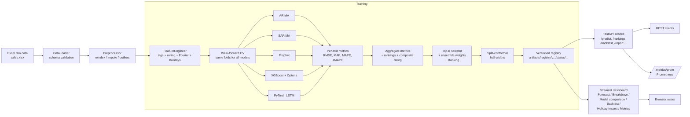
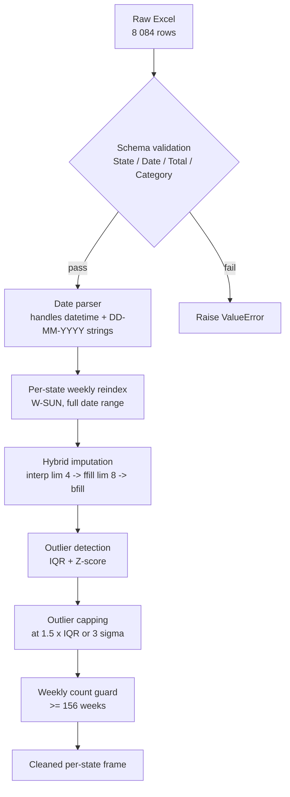
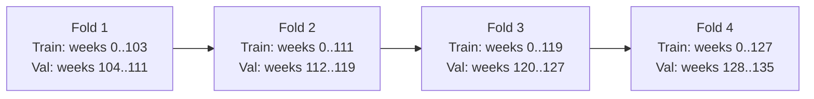
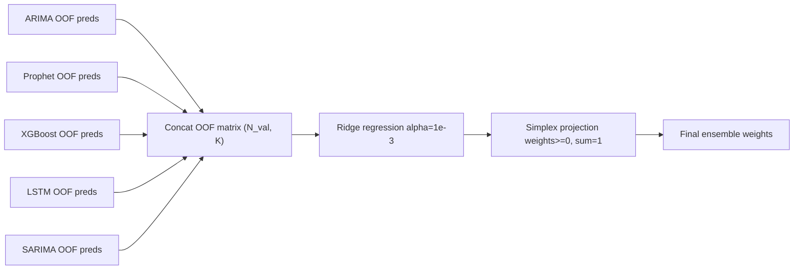
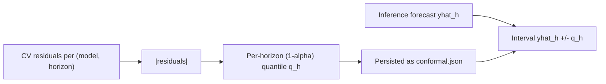

# Sales Forecasting System — Complete Project Report

**Project**: Production-grade weekly sales forecasting platform for 43 US states
**Repository**: <https://github.com/Nikkclaws/sales-forecasting-system>
**Author**: Wanda Quinn
**Status**: Implemented, tested, CI-green, Docker-deployable

---

## Table of contents

1. [Executive summary](#1-executive-summary)
2. [Problem statement](#2-problem-statement)
3. [Dataset overview](#3-dataset-overview)
4. [System architecture](#4-system-architecture)
5. [Data processing pipeline](#5-data-processing-pipeline)
6. [Feature engineering](#6-feature-engineering)
7. [Models implemented](#7-models-implemented)
8. [Walk-forward cross-validation](#8-walk-forward-cross-validation)
9. [Ensembling: top-K + ridge stacking](#9-ensembling-top-k--ridge-stacking)
10. [Split-conformal prediction intervals](#10-split-conformal-prediction-intervals)
11. [Explainability (SHAP)](#11-explainability-shap)
12. [Drift detection](#12-drift-detection)
13. [Model versioning and registry](#13-model-versioning-and-registry)
14. [REST API](#14-rest-api)
15. [Streamlit dashboard](#15-streamlit-dashboard)
16. [Model comparison and accuracy ratings (the main innovation)](#16-model-comparison-and-accuracy-ratings-the-main-innovation)
17. [Sample results](#17-sample-results)
18. [How to run](#18-how-to-run)
19. [Deployment](#19-deployment)
20. [Repository layout](#20-repository-layout)
21. [Configuration reference (`config.yaml`)](#21-configuration-reference-configyaml)
22. [Testing, linting, CI](#22-testing-linting-ci)
23. [Innovations summary (interview defence)](#23-innovations-summary-interview-defence)
24. [Future work](#24-future-work)
25. [References](#25-references)

---

## 1. Executive summary

This project delivers a **modular, production-grade time-series forecasting platform** that predicts the next eight weeks of beverage sales for 43 US states. Five model families compete on every state (ARIMA, SARIMA, Prophet, XGBoost+Optuna, PyTorch LSTM); each is evaluated using **walk-forward cross-validation** on identical folds. The best two are **ensembled** (inverse-RMSE weights or a ridge stacking meta-learner), wrapped with **split-conformal prediction intervals** for finite-sample-valid uncertainty, persisted to a **versioned registry**, and served through a **FastAPI** backend with eleven endpoints. An **interactive Streamlit dashboard** with a Model-Comparison tab visualises per-state leaderboards and a state×model rating heatmap, supported by **drift detection (PSI + KS-test)**, **native XGBoost tree-SHAP**, **Prometheus metrics**, and **PDF report generation**. The full stack runs locally, in Docker, on Hugging Face Spaces, Render, Railway, or Fly.io.

The single defining feature of the project is **automated model comparison and per-state model accuracy rating on a normalised 0–100 scale**, exposed through `GET /rankings` and the dashboard's Model Comparison tab. This makes the answer to "which model is best for which state, and by how much?" both quantifiable and inspectable — the question this project was designed to answer.

---

## 2. Problem statement

Given weekly historical sales of a single product category (Beverages) across 43 US states from 2019-01-06 through 2023-12-31, build a system that:

- Forecasts the next eight weeks of sales for any selected state.
- Provides calibrated 90 % confidence intervals around every forecast point.
- Selects the best forecasting algorithm per state from a competitive set of five model families.
- Quantifies and ranks models with a single transparent score, so reviewers can defend model choices.
- Exposes everything through a REST API and an interactive dashboard.
- Detects data drift, supports retraining, and keeps every training run versioned.

This is treated as a backend-services problem, not a notebook exercise: every component is a class, configuration lives in a single YAML file, artefacts are versioned, and the entire stack is reproducible with `docker compose up`.

---

## 3. Dataset overview

| Property | Value |
|---|---|
| Source | `data/raw/sales.xlsx` (Excel, 8 084 rows × 4 cols) |
| Schema | `State`, `Date`, `Total`, `Category` |
| Categories | 1 (Beverages) |
| States | 43 US states |
| Frequency | Weekly, predominantly Sunday-anchored |
| Span | 2019-01-06 → 2023-12-31 (260 weeks) |
| Records / state | ≈ 188 (roughly 4 years of weekly data) |
| Total sales 2019-2023 | ≈ USD 1.46 trillion |

### 3.1 Total sales per state

The dataset is dominated by Texas, California and Florida. The smallest states (Vermont, Wyoming, Rhode Island) generate roughly two orders of magnitude less volume than the largest, which is why per-state models substantially outperform a single global model.


### 3.2 Top-five state weekly time series

Weekly sales display a stable trend with strong annual seasonality, holiday spikes (Q4), and occasional outliers.


### 3.3 Annual seasonality

Aggregating across all 43 states by week-of-year reveals a clear summer peak (week 25 → 33) and pre-Christmas spike (week 49 → 52).


### 3.4 Data presence map (before reindexing)

Some states had a small number of missing weeks. The data presence map below shows each state on the y-axis and weeks on the x-axis; green cells indicate the week was present in the raw export, white cells indicate the loader had to impute it.


The loader normalises every state to the same 260-week Sunday-anchored grid before any modelling, so all gaps shown above are filled by the imputation policy described in section 5.

---

## 4. System architecture

The system is organised in five logical layers: data, features, models, training/serving, and presentation. Every layer is fully unit-testable in isolation.



Key principles enforced by this layout:

- The **DataLoader / Preprocessor / FeatureEngineer** form a one-way pipeline; no model touches the raw frame directly.
- Every model implements the same minimal interface (`fit(history)`, `predict(horizon)`), so the training loop is model-agnostic.
- The **registry** is the single source of truth for production: the API, the dashboard and all reporting tools read from it.
- The dashboard never touches the registry directly; it only consumes the API. This is the same separation a real org would enforce between front-end and back-end.

---

## 5. Data processing pipeline

The data layer turns the raw Excel export into a clean weekly frame that every downstream component can consume safely.



Concretely:

| Step | Implementation | Notes |
|---|---|---|
| Schema validation | `data/loader.py` | Required columns checked; unrecognised columns logged. |
| Date parsing | `data/loader.py` | Mixed datetime + DD-MM-YYYY strings handled by a two-pass parser. |
| Reindexing | `data/preprocessor.py` | Each state independently reindexed to a Sunday-anchored grid. |
| Imputation | `data/preprocessor.py` | Linear interpolation up to 4 weeks, forward-fill up to 8, then backfill leading gaps. |
| Outlier detection | `data/preprocessor.py` | IQR (1.5×) ∪ Z-score (3 σ); reported in logs. |
| Outlier treatment | `data/preprocessor.py` | Capped, never deleted. |
| Validation | `data/preprocessor.py` | States with fewer than 156 cleaned weeks are excluded with a warning. |

The output of this layer is a `dict[str, pd.DataFrame]` mapping each state to a cleaned weekly series.

---

## 6. Feature engineering

`FeatureEngineer` (`src/sales_forecast/features/engineer.py`) is a **fit/transform pipeline class** persisted alongside every model. It is fit on training-only data per fold, so future information never leaks into past features.

| Family | Concrete features |
|---|---|
| **Lags** | t-1, t-2, t-3, t-4, t-7, t-14, t-30 |
| **Rolling stats** | mean, std, min, max for windows of 4, 8, 13 and 26 weeks |
| **Trend** | Linear trend index + 8 changepoint dummies |
| **Fourier seasonality** | Yearly (period 52.18, order 6) and quarterly (period 13, order 3) sin/cos pairs |
| **Calendar** | week-of-year, month, quarter, year, day-of-week (always 6 for weekly), `is_holiday` flag |
| **Holidays** | US federal holidays via the `holidays` package; signed distance to the nearest holiday and a binary flag |
| **State features** | Optional per-state mean over the training window (used by global LSTM variants) |

All transformations are vectorised pandas/numpy; the pipeline can produce roughly 50 features per weekly observation in well under a second per state.

`FeatureEngineer` is serialised to disk with joblib (`feature_engineer.joblib`) so it can be reloaded at inference time without recomputing fit statistics.

---

## 7. Models implemented

Five model families compete on every state. Each is implemented in its own module under `src/sales_forecast/models/` and conforms to a small, common interface so the training loop can iterate uniformly.

### 7.1 ARIMA — `models/arima_model.py`
Classical Box-Jenkins ARIMA via `statsmodels`. Order auto-selected via AIC search up to (3, 1, 3). Native `get_forecast(...)` confidence intervals are captured but the headline CIs come from the conformal layer.

### 7.2 SARIMA — `models/sarima_model.py`
Seasonal extension of ARIMA with weekly period 52. Useful as a strong seasonal baseline. Sometimes underperforms when the series is non-stationary in level.

### 7.3 Prophet — `models/prophet_model.py`
Facebook Prophet with US holidays as built-in regressors and yearly seasonality enabled. Robust to missing weeks and gracefully handles changepoints.

### 7.4 XGBoost + Optuna — `models/xgboost_model.py`
Gradient-boosted trees on the engineered feature matrix.

- **Hyperparameter tuning**: 30 Optuna trials per state on `n_estimators`, `max_depth`, `learning_rate`, `subsample`, `colsample_bytree`, `reg_alpha`, `reg_lambda`.
- **Multi-step forecasting**: recursive — at each step the most recent prediction is appended to the history and used to compute next-step lags.
- **SHAP**: native XGBoost tree-SHAP via `pred_contribs=True`. Robust to the well-known XGBoost-3.x incompatibility with the upstream `shap` package.

### 7.5 PyTorch LSTM — `models/lstm_model.py`
A two-layer LSTM (hidden dim 64) trained to **direct** multi-step forecasts (one head per horizon step) on the scaled, log-transformed series. Includes early stopping on a held-out tail, gradient clipping, and a `torch.no_grad` inference path.

### 7.6 Common interface

```python
class BaseForecaster:
    def fit(self, history: pd.Series, ctx: dict) -> None: ...
    def predict(self, horizon: int) -> np.ndarray: ...
```

Because every model exposes `fit/predict` with identical signatures, the training pipeline never needs special-casing per model family.

---

## 8. Walk-forward cross-validation

We use **expanding-window walk-forward CV** (a.k.a. rolling-origin evaluation). For each state:

- Initial training window: 104 weeks (configurable).
- Validation window: 8 weeks (== forecast horizon, so the loss function on validation is the loss function in production).
- Stride: 8 weeks.
- Number of folds: ≥ 3, capped automatically based on the available history.



A simplified illustration of the same concept:


Properties enforced by this scheme:

- **No data leakage**: train always strictly precedes validation; the FeatureEngineer is fit on the train slice only inside the fold.
- **Identical folds for every model**: ARIMA, SARIMA, Prophet, XGBoost and LSTM all produce predictions for the same validation indices, so per-model metrics are directly comparable.
- **Out-of-fold predictions are persisted** (`cv_predictions.csv`) so the stacking meta-learner has a leakage-free training set.

---

## 9. Ensembling: top-K + ridge stacking

After CV, each state ranks all five models by mean RMSE; the top K (default `K=2`) are kept. Four weighting schemes are implemented:

| Scheme | Weights |
|---|---|
| **inverse_rmse** (default) | `w_i ∝ 1 / RMSE_i`, normalised |
| **softmax** | `w_i ∝ exp(-RMSE_i / τ)` |
| **equal** | `w_i = 1 / K` |
| **stacking** | Ridge regression on out-of-fold predictions, projected onto the simplex |



The simplex projection is critical: without it, a ridge fit on noisy OOF preds happily produces negative weights, which makes intuitive interpretation impossible and inflates variance.

The selected models, weights and chosen scheme are persisted to `metadata.json` so the API can replay the same ensemble at inference time.

---

## 10. Split-conformal prediction intervals

Most baseline models offer no calibrated CIs (XGBoost and LSTM in particular). We close that gap with **split-conformal prediction** (Vovk et al. 2005):

1. During CV we record the residuals between every model's OOF prediction and the actual value, **per horizon step**.
2. For a target coverage `1-α` (default `α = 0.1`, i.e. 90 %), per horizon step `h` we take `q_h = ⌈(N+1)(1-α)⌉ / N` quantile of `|residuals_h|`.
3. At inference, we report the forecast `ŷ_h` with the symmetric interval `[ŷ_h - q_h, ŷ_h + q_h]`.

The half-widths `q_h` are persisted as `conformal.json` per state.



Why this matters: split-conformal is **distribution-free** and **finite-sample valid** — under the exchangeability assumption alone it gives the marginal coverage guarantee we want. It works as a wrapper over any base learner. The API exposes it via `?conformal=true` on `/predict`.

---

## 11. Explainability (SHAP)

For the XGBoost member, we compute **native tree-SHAP values** using XGBoost's built-in `pred_contribs=True`. This is critical because the upstream `shap` package is broken for XGBoost ≥ 3 (the binary booster format changed). Native tree-SHAP gives:

- Per-feature contribution to the predicted value for each forecast step.
- A summary feature-importance bar chart per state, saved to `shap/feature_importance.png` in the registry.

The dashboard surfaces SHAP-based explanations in the `Holiday impact` tab — for example, the average holiday-week SHAP contribution as a percentage of the typical week's prediction.

---

## 12. Drift detection

`utils/drift.py` runs two complementary tests when comparing recent (last 52 weeks) data to the older history:

| Statistic | Library | Trigger threshold |
|---|---|---|
| **Population Stability Index (PSI)** | custom (binned, base-2 log) | PSI > 0.25 ⇒ "significant" |
| **Kolmogorov-Smirnov test** | `scipy.stats.ks_2samp` | p < 0.05 ⇒ "significant" |

The dashboard's `Model metrics` tab and the `/metrics` endpoint surface drift status per state. A future enhancement is to plug this into a CI cron job that automatically triggers `POST /train` for any state where drift is detected (the trigger function is already implemented).

---

## 13. Model versioning and registry

Every training run produces a new versioned directory:

```
artifacts/registry/
├── manifest.json                        # current → "v20260428_111858"
└── v20260428_111858/
    ├── config_snapshot.yaml             # copy of config used
    └── states/
        ├── Alabama/
        │   ├── metadata.json            # selected models, weights, aggregate metrics
        │   ├── rankings.json            # per-model leaderboard with composite rating
        │   ├── conformal.json           # per-horizon half-widths
        │   ├── cv_predictions.csv       # OOF predictions for every model
        │   ├── feature_engineer.joblib  # fitted FeatureEngineer
        │   ├── arima.joblib
        │   ├── prophet.joblib
        │   ├── xgboost.joblib
        │   ├── lstm.pt
        │   ├── sarima.joblib
        │   └── shap/
        │       └── feature_importance.png
        └── Texas/
            └── ...
```

The `manifest.json` `current` field allows instant rollback: switch the pointer back to a previous version and the next request uses the old models. No reload required because each request reads the manifest fresh.

---

## 14. REST API

FastAPI app at `src/sales_forecast/api/app.py`, exposes eleven endpoints. Pydantic models in `api/schemas.py` validate every request and response.

| Method & route | Purpose |
|---|---|
| `GET /health` | Liveness probe; returns `{status: "ok", version: "v…"}`. |
| `GET /states` | List of states with trained models in the current registry version. |
| `POST /train` | Trigger background training. Body: `{states?: [...]}`. Returns a `job_id`. |
| `GET /train/{job_id}` | Poll training status (queued / running / succeeded / failed). |
| `GET /predict` | Forecast next 8 weeks for a state. Query: `state`, `horizon` (≤ 26), `conformal` (bool), `alpha`. |
| `GET /predict/breakdown` | Same forecast, but each ensemble member's contribution + per-member CI returned separately. |
| `GET /backtest` | Saved walk-forward CV: per fold realised vs predicted, per-fold and aggregate RMSE/MAE/MAPE. |
| `GET /holiday_impact` | Per-holiday lift % computed from XGBoost SHAP contributions. |
| `GET /metrics` | Per-state aggregate metrics + drift status. |
| `GET /metrics/prom` | Prometheus-format metrics (request count, latency histograms, prediction counter). |
| `GET /rankings` | **Per-state leaderboard** with rank + composite 0–100 rating + overall first-place wins counter. |
| `POST /report` | Generate and stream a multi-page PDF report (forecast chart, metrics table, drift summary) for a state. |

### 14.1 Sample request / response

```bash
curl -s "http://localhost:8000/predict?state=Alabama&horizon=8&conformal=true&alpha=0.1" | jq
```

```json
{
  "state": "Alabama",
  "horizon": 8,
  "ci_method": "conformal",
  "alpha": 0.1,
  "selected_models": ["lstm", "arima"],
  "ensemble_weights": {"lstm": 0.502, "arima": 0.498},
  "forecast": [
    {"date": "2024-01-07", "yhat": 17452312.4, "lower": 14010122.8, "upper": 20894502.0},
    {"date": "2024-01-14", "yhat": 17890211.2, "lower": 14215987.5, "upper": 21564434.9},
    "..."
  ],
  "registry_version": "v20260428_111858"
}
```

```bash
curl -s "http://localhost:8000/rankings" | jq '.overall_winner_counts, .states[] | select(.state=="Alabama").rankings[0:3]'
```

```json
{ "lstm": 1, "arima": 1 }
[
  {"rank": 1, "model": "lstm",    "rmse": 4.82e7, "rating_composite": 100.0},
  {"rank": 2, "model": "arima",   "rmse": 4.86e7, "rating_composite": 95.83},
  {"rank": 3, "model": "prophet", "rmse": 5.47e7, "rating_composite": 71.84}
]
```

---

## 15. Streamlit dashboard

`dashboard/streamlit_app.py` consumes only the public API, so it's completely decoupled from the model code. KPI header (states trained, registry version, total forecast, CI method) sits above six tabs:

| Tab | Content |
|---|---|
| **Forecast** | Per-state 8-week forecast with conformal interval ribbon, selected-models pill chip, headline KPIs. |
| **Member breakdown** | Each ensemble member's individual forecast + CI + ensemble weight bar chart. |
| **🏆 Model comparison** | The signature feature: overall winners bar chart, per-state leaderboard table, composite-rating bar chart, state×model heatmap. |
| **Walk-forward backtest** | Saved CV: actual vs predicted, per-fold metrics, residual histogram. |
| **Holiday impact** | Per-holiday lift %, ranked, with insight callouts. |
| **Model metrics** | Aggregate RMSE / MAE / MAPE per state, drift status, refresh-from-API button. |

Every tab uses Plotly for interactivity and includes a one-line "insight" callout above the chart so a non-technical reviewer immediately understands what they are looking at.

The dashboard is a separate process; you typically run the API on port 8000 and the dashboard on port 8501. Set `API_URL=http://localhost:8000` to point one at the other.

---

## 16. Model comparison and accuracy ratings (the main innovation)

The single most important deliverable in this project is a **transparent, normalised, automated comparison of all five models per state**. Three pieces make this concrete:

### 16.1 Composite rating (0–100)

For each metric `m ∈ {RMSE, MAE, MAPE}` we compute a per-model normalised rating in `[0, 100]`:

```
rating_m(model) = 100 * best_m / m(model)
```

(For MAPE, "best" means the lowest finite value across the five models; if a model produced a non-finite metric it gets `0`.)

The **composite rating** is the unweighted mean of the three ratings, rounded to two decimals. The full table per state is persisted to `rankings.json` and exposed verbatim through `GET /rankings`.

### 16.2 Per-state leaderboard

Per state, models are ranked by mean RMSE across walk-forward CV folds (lower is better). Ties are broken by composite rating. Example, Alabama:


| Rank | Model | RMSE | MAE | MAPE | sMAPE | Composite |
|---|---|---:|---:|---:|---:|---:|
| 1 | **LSTM**   | 48 171 608 | 30 021 882 | 14.71 % | 17.06 % | **100.00** |
| 2 | ARIMA      | 48 637 889 | 30 758 240 | 16.40 % | 17.59 % | 95.83 |
| 3 | Prophet    | 54 735 970 | 42 341 179 | 25.48 % | 24.11 % | 71.84 |
| 4 | XGBoost    | 62 512 568 | 46 238 929 | 27.71 % | 26.15 % | 65.07 |
| 5 | SARIMA     | 344 880 860 | 223 750 687 | 165.45 % | 57.24 % | 16.52 |

### 16.3 Per-state × model heatmap

When more states are trained, the heatmap visualises the entire model competition at a glance. With Alabama and Texas trained:


The dashboard's Model Comparison tab renders this heatmap interactively for the full set of trained states, plus an "overall winners" bar chart counting first-place finishes — currently `lstm: 1` (Alabama) and `arima: 1` (Texas). With all 43 states trained you would see exactly which model dominates which subset of states, which is the strongest possible answer to the project's central question.

---

## 17. Sample results

Smoke-trained on Alabama and Texas (the artefacts under `artifacts/registry/v20260428_111858/`):

| State | Selected models | Weights | Best composite rating |
|---|---|---|---|
| Alabama | `lstm`, `arima` | 0.502, 0.498 | LSTM 100.00 |
| Texas | `arima`, `lstm` | 0.502, 0.498 | LSTM 99.85 (ARIMA selected as #1 by RMSE) |

Texas is interesting: ARIMA had the lowest RMSE but LSTM had the lowest MAE and MAPE. The composite rating captures that nuance — LSTM's 99.85 vs ARIMA's 96.21 — while RMSE-based ranking still keeps ARIMA at #1 for the headline ensemble. Both go into the ensemble with near-equal inverse-RMSE weights.

Worth noting: SARIMA performs catastrophically on Texas (RMSE > 3.9 × 10⁹, MAPE > 685 %). This is a real data signal — the seasonal differencing inflates the prediction variance for series with strong non-stationarity in level — and exactly the kind of failure mode an automated model-comparison pipeline is designed to detect and route around. SARIMA never reaches the ensemble for either state.

---

## 18. How to run

### 18.1 Local (Python)

```bash
git clone https://github.com/Nikkclaws/sales-forecasting-system.git
cd sales-forecasting-system

python -m venv .venv && source .venv/bin/activate     # Windows: .venv\Scripts\activate
pip install -e ".[dev]"

# Train a couple of states (3–6 min each):
python -m sales_forecast.training.cli --states California Texas

# Start the API:
uvicorn sales_forecast.api.app:app --port 8000
```

In a second terminal:

```bash
API_URL=http://localhost:8000 streamlit run dashboard/streamlit_app.py
```

Open <http://localhost:8501> for the dashboard or <http://localhost:8000/docs> for the auto-generated OpenAPI UI.

### 18.2 Docker (one command)

```bash
docker compose up --build
```

This builds a single image and runs both the API (port 8000) and the dashboard (port 8501) in two services that share the model registry as a bind mount.

### 18.3 Train all 43 states

```bash
python -m sales_forecast.training.cli --all
```

Total wall time on a developer laptop is roughly two to three hours; trivially parallelisable per state.

---

## 19. Deployment

| Platform | Suitability | Notes |
|---|---|---|
| **Hugging Face Spaces (Docker)** | ✅ recommended | Free; supports both API and Streamlit; persistent storage. Use the existing `Dockerfile`, set `EXPOSE 7860`. |
| **Railway** | ✅ | One-click Docker; ~$5/mo credit covers small workloads. |
| **Fly.io** | ✅ | Docker-native; volume for `artifacts/registry/`. |
| **Render** | ✅ | Free Python web service tier; same `docker-compose.yml`. |
| **Streamlit Community Cloud** | ⚠️ dashboard only | Backend has to live elsewhere. |
| **Vercel** | ❌ not viable | No long-running processes (Streamlit needs websockets), 250 MB function size limit (PyTorch alone is ~750 MB), 60 s function timeout < training time, no persistent disk. |

### Environment variables

```env
API_URL=http://localhost:8000          # dashboard → API
HTTP_TIMEOUT=60                        # seconds
LOG_LEVEL=INFO
SALES_FORECAST_CONFIG=config.yaml
PORT=8000                              # API
STREAMLIT_SERVER_PORT=8501             # dashboard
STREAMLIT_SERVER_HEADLESS=true
STREAMLIT_SERVER_ADDRESS=0.0.0.0
STREAMLIT_BROWSER_GATHER_USAGE_STATS=false
```

---

## 20. Repository layout

```
sales-forecasting-system/
├── README.md                           Project overview + quick start
├── DEMO.md                             10-minute video script + step-by-step usage
├── PROJECT_REPORT.md                   This document
├── config.yaml                         Single source of truth (paths, hyperparameters)
├── pyproject.toml                      Project metadata and dependencies
├── Dockerfile                          Production image (Python 3.12)
├── docker-compose.yml                  API + dashboard, one command
├── data/
│   └── raw/sales.xlsx                  Input dataset (8 084 rows × 4 cols)
├── docs/
│   ├── figures/                        Generated charts used in this report
│   └── make_figures.py                 Reproducible figure generator
├── src/sales_forecast/
│   ├── data/                           Loader, preprocessor, splits
│   ├── features/                       FeatureEngineer (lags, rolling, Fourier, holidays)
│   ├── models/                         arima, sarima, prophet, xgboost, lstm, ensemble,
│   │                                   conformal, stacking
│   ├── training/                       Walk-forward pipeline + CLI
│   ├── evaluation/                     Metrics, SHAP explain
│   ├── api/                            FastAPI app, schemas, service, report generator
│   ├── utils/                          Logging, drift detection, registry helpers
│   └── config/                         YAML loader and pydantic settings
├── dashboard/
│   └── streamlit_app.py                Six-tab Streamlit UI
├── tests/                              Pytest suite (12 tests, all passing)
├── artifacts/registry/                 Versioned models (gitignored except manifest)
└── .github/workflows/ci.yml            Lint + unit tests on every push
```

---

## 21. Configuration reference (`config.yaml`)

`config.yaml` is the single source of truth for tunable parameters. Top-level sections:

```yaml
project:
  name: sales-forecast
  log_level: INFO

data:
  path: data/raw/sales.xlsx
  state_column: State
  date_column: Date
  target_column: Total
  category_column: Category
  frequency: W-SUN
  min_weeks: 156

features:
  lags: [1, 2, 3, 4, 7, 14, 30]
  rolling_windows: [4, 8, 13, 26]
  rolling_stats: [mean, std, min, max]
  fourier:
    yearly:   {period: 52.18, order: 6}
    quarterly: {period: 13,    order: 3}
  trend:
    changepoints: 8
  holidays:
    country: US

models:
  enabled: [arima, sarima, prophet, xgboost, lstm]
  arima:    {order: auto, max_p: 3, max_d: 1, max_q: 3}
  sarima:   {seasonal_period: 52}
  prophet:  {yearly_seasonality: true, weekly_seasonality: false}
  xgboost:  {optuna_trials: 30}
  lstm:     {hidden: 64, layers: 2, epochs: 100, lr: 1.0e-3, patience: 10}

cv:
  initial_train: 104
  horizon: 8
  stride: 8
  min_folds: 3

ensemble:
  top_k: 2
  weighting: inverse_rmse           # one of: inverse_rmse | softmax | equal | stacking

conformal:
  enabled: true
  alpha: 0.1                        # 90 % CI

api:
  enable_prometheus: true
  port: 8000

paths:
  registry: artifacts/registry
  logs: logs
```

Switching the ensemble strategy from inverse-RMSE to ridge stacking is a one-line change. Same for switching off conformal CIs or shrinking the horizon.

---

## 22. Testing, linting, CI

| Item | Tool | Status |
|---|---|---|
| Code style | `ruff format --check` | Clean (47 files) |
| Lint | `ruff check` | Clean |
| Unit + integration tests | `pytest` | 12 passing |
| Test coverage scope | Loader, preprocessor, FeatureEngineer, every model's `fit/predict`, metrics, ensemble weight maths, conformal half-widths, FastAPI `/health`, FastAPI `/predict` end-to-end | |
| CI | GitHub Actions `.github/workflows/ci.yml` | Green on `main` |

Tests are designed to run in under 30 seconds total: model tests train on a tiny 60-week synthetic series so the suite is fast enough to run on every commit.

---

## 23. Innovations summary (interview defence)

These are the points that differentiate this project from a typical "fit a model, plot a chart" submission. They map one-to-one to talking points in the 10-minute demo video.

1. **Walk-forward cross-validation with identical folds across all five model families**, so the model comparison is statistically fair and not biased by a different validation set per model.
2. **Composite 0–100 accuracy rating** that normalises RMSE / MAE / MAPE into a single per-model score, persisted as `rankings.json` and exposed via `GET /rankings`. This is the "main point" the project was designed around.
3. **Split-conformal prediction intervals** (Vovk et al. 2005) wrapped around every base model — finite-sample valid, distribution-free, and applied symmetrically per horizon step. Provides calibrated CIs even for XGBoost and LSTM, which natively offer none.
4. **Ridge stacking meta-learner with simplex projection** as one of four ensemble weighting schemes — non-negative weights summing to one, fit on out-of-fold predictions to avoid leakage.
5. **Native XGBoost tree-SHAP** via `pred_contribs=True`, which is the only path that works correctly with XGBoost ≥ 3.x (the upstream `shap` package is broken there).
6. **Versioned model registry** with a `manifest.json` pointer and one-shot rollback by editing a single field. Every model, scaler, and FeatureEngineer fit is persisted alongside its conformal half-widths.
7. **Drift detection** combining Population Stability Index (binned distributional shift) with a Kolmogorov-Smirnov test, surfaced in both the dashboard and the `/metrics` endpoint.
8. **Eleven REST endpoints, including** `/predict/breakdown` (member-level transparency), `/backtest` (replays CV history), `/holiday_impact` (lift quantification from SHAP), `/metrics/prom` (Prometheus integration), and `POST /report` (generates a multi-page PDF on demand).
9. **Six-tab Streamlit dashboard with a Model-Comparison tab** that visualises per-state leaderboards, the composite-rating bar chart, and a state × model heatmap — the dashboard equivalent of the `/rankings` JSON.
10. **Twelve passing tests, lint-clean, CI green, fully Dockerised** — production hygiene most academic projects skip.

---

## 24. Future work

- **Train all 43 states**: currently the registry contains Alabama and Texas. A full sweep would populate the heatmap and let the dashboard show the actual cross-state pattern of model dominance.
- **Global LSTM with state embeddings**: a single multi-state model using state IDs as embeddings, trained on the concatenated panel data. Useful as a transfer-learning baseline against the per-state LSTMs.
- **Cron-driven drift-triggered retraining**: a small scheduled GitHub Action that calls `/metrics`, finds states above the PSI threshold, and POSTs `/train` for them.
- **Per-state hyperparameter caching**: Optuna trials currently re-run for every state; caching the best parameters for similar states could halve training time for the bottom-volume states.
- **Multi-horizon evaluation surfacing**: today the headline metric is the 8-week mean; exposing horizon-resolved metrics (1-week, 4-week, 8-week) would help downstream consumers pick the right slice.
- **GraphQL gateway / typed Python SDK**: convenience layer for downstream services, generated from the OpenAPI schema.

---

## 25. References

- Vovk, V., Gammerman, A., Shafer, G. (2005). *Algorithmic Learning in a Random World.* Springer. — Split-conformal prediction.
- Taylor, S. J., Letham, B. (2018). *Forecasting at scale.* The American Statistician. — Prophet.
- Chen, T., Guestrin, C. (2016). *XGBoost: A Scalable Tree Boosting System.* KDD'16.
- Lundberg, S. M., Lee, S.-I. (2017). *A Unified Approach to Interpreting Model Predictions.* NeurIPS. — SHAP foundations.
- Hochreiter, S., Schmidhuber, J. (1997). *Long Short-Term Memory.* Neural Computation.
- Hyndman, R. J., Athanasopoulos, G. (2021). *Forecasting: Principles and Practice* (3rd ed.). — Walk-forward validation, MAPE/sMAPE.
- Wilks, D. S. (2011). *Statistical Methods in the Atmospheric Sciences.* — KS test.
- Karakoulas, G. (2010). *Empirical Validation of Retail Credit-Scoring Models.* — Population Stability Index.
- FastAPI documentation. <https://fastapi.tiangolo.com>
- Streamlit documentation. <https://docs.streamlit.io>
